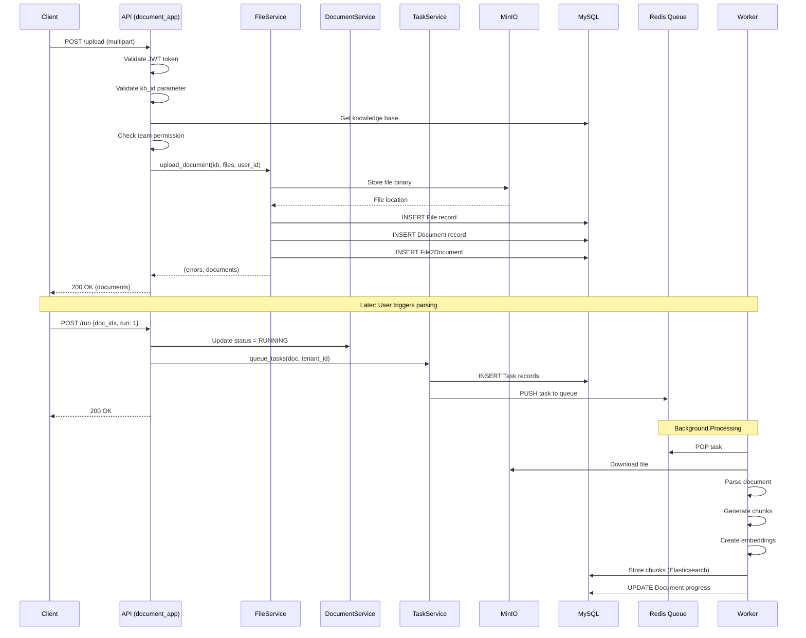

# Document App Analysis

## Tổng Quan

`document_app.py` (708 lines) là blueprint xử lý tất cả operations liên quan đến document management: upload, parsing, status tracking, và deletion.

## File Location
```
/api/apps/document_app.py
```

## API Endpoints

| Endpoint | Method | Auth | Mô Tả |
|----------|--------|------|-------|
| `/upload` | POST | Required | Upload files to knowledge base |
| `/web_crawl` | POST | Required | Crawl and add web content |
| `/create` | POST | Required | Create virtual document |
| `/list` | POST | Required | List documents with filters |
| `/filter` | POST | Required | Get filterable metadata |
| `/run` | POST | Required | Execute document processing |
| `/rm` | POST | Required | Delete documents |
| `/change_status` | POST | Required | Enable/disable documents |
| `/change_parser` | POST | Required | Switch parsing engine |
| `/rename` | POST | Required | Rename documents |
| `/set_meta` | POST | Required | Set metadata (JSON) |
| `/get/<doc_id>` | GET | Optional | Retrieve raw document |
| `/image/<image_id>` | GET | Optional | Get document thumbnail |

## Core Flow: Document Upload

```
┌─────────────────────────────────────────────────────────────────────────┐
│                         DOCUMENT UPLOAD FLOW                             │
└─────────────────────────────────────────────────────────────────────────┘

Client Request                    API Layer                    Storage/DB
     │                               │                              │
     │  POST /upload                 │                              │
     │  multipart/form-data          │                              │
     │  - kb_id                      │                              │
     │  - file(s)                    │                              │
     ├──────────────────────────────►│                              │
     │                               │                              │
     │                    ┌──────────┴──────────┐                   │
     │                    │ @login_required     │                   │
     │                    │ @validate_request   │                   │
     │                    │   ("kb_id")         │                   │
     │                    └──────────┬──────────┘                   │
     │                               │                              │
     │                    ┌──────────┴──────────┐                   │
     │                    │ KnowledgebaseService│                   │
     │                    │   .get_by_id(kb_id) │                   │
     │                    └──────────┬──────────┘                   │
     │                               │                              │
     │                    ┌──────────┴──────────┐                   │
     │                    │ check_kb_team_      │                   │
     │                    │   permission(kb,    │                   │
     │                    │   current_user.id)  │                   │
     │                    └──────────┬──────────┘                   │
     │                               │                              │
     │                    ┌──────────┴──────────┐                   │
     │                    │ FileService.        │                   │
     │                    │   upload_document() │                   │
     │                    └──────────┬──────────┘                   │
     │                               │                              │
     │                               │    Store binary              │
     │                               ├─────────────────────────────►│ MinIO
     │                               │                              │
     │                               │    Create File record        │
     │                               ├─────────────────────────────►│ MySQL
     │                               │                              │
     │                               │    Create Document record    │
     │                               ├─────────────────────────────►│ MySQL
     │                               │                              │
     │                               │    Create File2Document      │
     │                               ├─────────────────────────────►│ MySQL
     │                               │                              │
     │  200 OK                       │                              │
     │  {code: 0, data: [...]}       │                              │
     │◄──────────────────────────────┤                              │
     │                               │                              │
```

## Code Analysis

### Upload Endpoint

```python
@manager.route("/upload", methods=["POST"])
@login_required
@validate_request("kb_id")
async def upload():
    """
    Upload documents to a knowledge base.

    Request:
        - Content-Type: multipart/form-data
        - kb_id: Knowledge base ID
        - file: Binary file data (multiple allowed)

    Response:
        - code: 0 (success) or error code
        - data: List of uploaded document info
    """
    form = await request.form
    kb_id = form.get("kb_id")

    # 1. Get knowledge base
    e, kb = KnowledgebaseService.get_by_id(kb_id)
    if not e:
        raise LookupError("Can't find this knowledgebase!")

    # 2. Authorization check
    if not check_kb_team_permission(kb, current_user.id):
        return get_json_result(
            data=False,
            message="No authorization.",
            code=RetCode.AUTHENTICATION_ERROR
        )

    # 3. Get uploaded files
    file_objs = await request.files

    # 4. Process upload through FileService
    err, files = FileService.upload_document(kb, file_objs, current_user.id)

    if err:
        return get_json_result(
            data=files,
            message="\n".join(err),
            code=RetCode.SERVER_ERROR
        )

    return get_json_result(data=files)
```

### Document Processing (Run)

```python
@manager.route("/run", methods=["POST"])
@login_required
@validate_request("doc_ids", "run")
async def run():
    """
    Trigger document processing pipeline.

    Request:
        - doc_ids: List of document IDs
        - run: 1 (start) or 0 (cancel)

    Flow:
        1. Validate documents exist
        2. Check authorization
        3. Queue tasks for processing
        4. Return immediately (async processing)
    """
    req = await request.json
    doc_ids = req["doc_ids"]
    run_flag = req["run"]

    for doc_id in doc_ids:
        # Get document info
        info = {"run": str(run_flag), "progress": 0}
        info["progress_msg"] = "" if run_flag == 1 else "Task is cancelled."
        info["chunk_num"] = 0
        info["token_num"] = 0

        # Update document status
        DocumentService.update_by_id(doc_id, info)

        if run_flag == 1:
            # Queue for processing
            e, doc = DocumentService.get_by_id(doc_id)
            tenant_id = DocumentService.get_tenant_id(doc_id)

            # Reset chunks if re-running
            if doc.progress == 0:
                DocumentService.clear_chunk_num(doc_id)

            # Queue task
            TaskService.queue_tasks(doc, tenant_id)

    return get_json_result(data=True)
```

### List Documents with Filtering

```python
@manager.route("/list", methods=["POST"])
@login_required
async def list_docs():
    """
    List documents with pagination and filtering.

    Request:
        - kb_id: Knowledge base ID
        - keywords: Search keywords (optional)
        - page: Page number (default 1)
        - page_size: Items per page (default 15)
        - orderby: Sort field
        - desc: Sort descending (default True)
        - status: Filter by status

    Response:
        - docs: List of document objects
        - total: Total count
    """
    req = await request.json
    kb_id = req.get("kb_id")

    # Build query conditions
    conditions = {
        "kb_id": kb_id,
        "status": StatusEnum.VALID.value
    }

    if req.get("status"):
        conditions["run"] = req["status"]

    # Execute paginated query
    docs, total = DocumentService.get_list(
        conditions,
        page=req.get("page", 1),
        page_size=req.get("page_size", 15),
        orderby=req.get("orderby", "create_time"),
        desc=req.get("desc", True),
        keywords=req.get("keywords", "")
    )

    return get_json_result(data={"docs": docs, "total": total})
```

## Authorization Pattern

```python
# Pattern 1: Team Permission Check
if not check_kb_team_permission(kb, current_user.id):
    return get_json_result(
        data=False,
        message="No authorization.",
        code=RetCode.AUTHENTICATION_ERROR
    )

# Pattern 2: KB Accessibility Check
if not KnowledgebaseService.accessible(kb_id, current_user.id):
    return get_json_result(
        data=False,
        message='No authorization.',
        code=RetCode.AUTHENTICATION_ERROR
    )

# Pattern 3: Ownership Check
if not KnowledgebaseService.query(created_by=current_user.id, id=kb_id):
    return get_json_result(
        data=False,
        message='Only owner authorized for this operation.',
        code=RetCode.OPERATING_ERROR
    )
```

## Error Handling

```python
# Global exception handler in __init__.py
def server_error_response(e):
    logging.error("Unhandled exception", exc_info=(type(e), e, e.__traceback__))

    msg = repr(e).lower()

    # Authorization errors
    if getattr(e, "code", None) == 401 or "unauthorized" in msg:
        return get_json_result(code=RetCode.UNAUTHORIZED, message=repr(e))

    # Document store errors
    if "index_not_found_exception" in repr(e):
        return get_json_result(
            code=RetCode.EXCEPTION_ERROR,
            message="No chunk found, please upload file and parse it."
        )

    return get_json_result(code=RetCode.EXCEPTION_ERROR, message=repr(e))
```

## Sequence Diagram: Complete Upload & Parse Flow



## Performance Considerations

1. **Async File Handling**: Uses Quart's async file handling for large uploads
2. **Chunked Upload**: Supports streaming for large files (up to 1GB)
3. **Background Processing**: Document parsing happens asynchronously
4. **Progress Tracking**: Real-time progress via polling or WebSocket

## Related Files

- `/api/db/services/document_service.py` - Business logic
- `/api/db/services/file_service.py` - File operations
- `/api/db/services/task_service.py` - Task queue management
- `/rag/svr/task_executor.py` - Background task execution
