# RAGFlow - Sequence Diagrams

Tài liệu này mô tả các luồng xử lý chính trong hệ thống RAGFlow thông qua sequence diagrams.

## 1. User Authentication Flow

### 1.1 User Registration

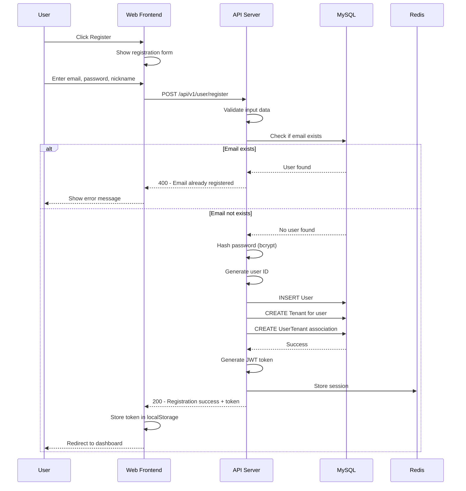
```mermaid
sequenceDiagram
    participant U as User
    participant W as Web Frontend
    participant A as API Server
    participant DB as MySQL
    participant R as Redis

    U->>W: Click Register
    W->>W: Show registration form
    U->>W: Enter email, password, nickname
    W->>A: POST /api/v1/user/register

    A->>A: Validate input data
    A->>DB: Check if email exists

    alt Email exists
        DB-->>A: User found
        A-->>W: 400 - Email already registered
        W-->>U: Show error message
    else Email not exists
        DB-->>A: No user found
        A->>A: Hash password (bcrypt)
        A->>A: Generate user ID
        A->>DB: INSERT User
        A->>DB: CREATE Tenant for user
        A->>DB: CREATE UserTenant association
        DB-->>A: Success
        A->>A: Generate JWT token
        A->>R: Store session
        A-->>W: 200 - Registration success + token
        W->>W: Store token in localStorage
        W-->>U: Redirect to dashboard
    end
```

### 1.2 User Login

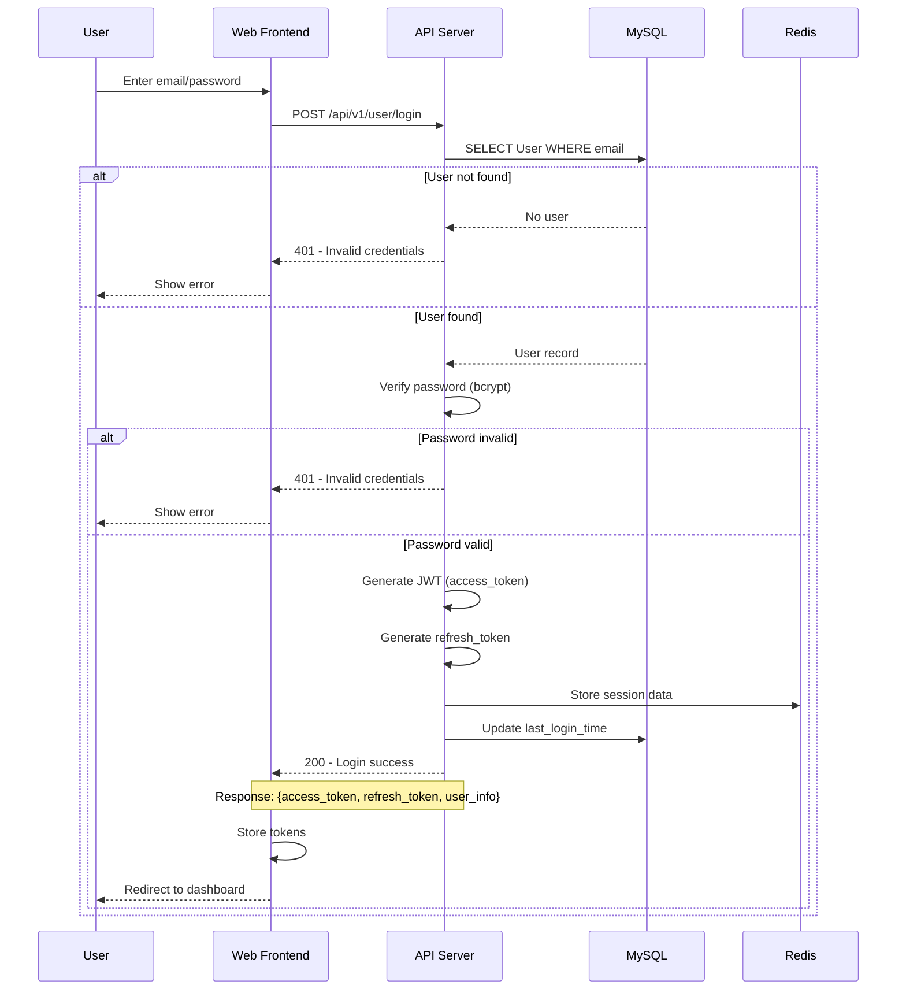
```mermaid
sequenceDiagram
    participant U as User
    participant W as Web Frontend
    participant A as API Server
    participant DB as MySQL
    participant R as Redis

    U->>W: Enter email/password
    W->>A: POST /api/v1/user/login

    A->>DB: SELECT User WHERE email

    alt User not found
        DB-->>A: No user
        A-->>W: 401 - Invalid credentials
        W-->>U: Show error
    else User found
        DB-->>A: User record
        A->>A: Verify password (bcrypt)

        alt Password invalid
            A-->>W: 401 - Invalid credentials
            W-->>U: Show error
        else Password valid
            A->>A: Generate JWT (access_token)
            A->>A: Generate refresh_token
            A->>R: Store session data
            A->>DB: Update last_login_time
            A-->>W: 200 - Login success
            Note over A,W: Response: {access_token, refresh_token, user_info}
            W->>W: Store tokens
            W-->>U: Redirect to dashboard
        end
    end
```

## 2. Knowledge Base Management

### 2.1 Create Knowledge Base

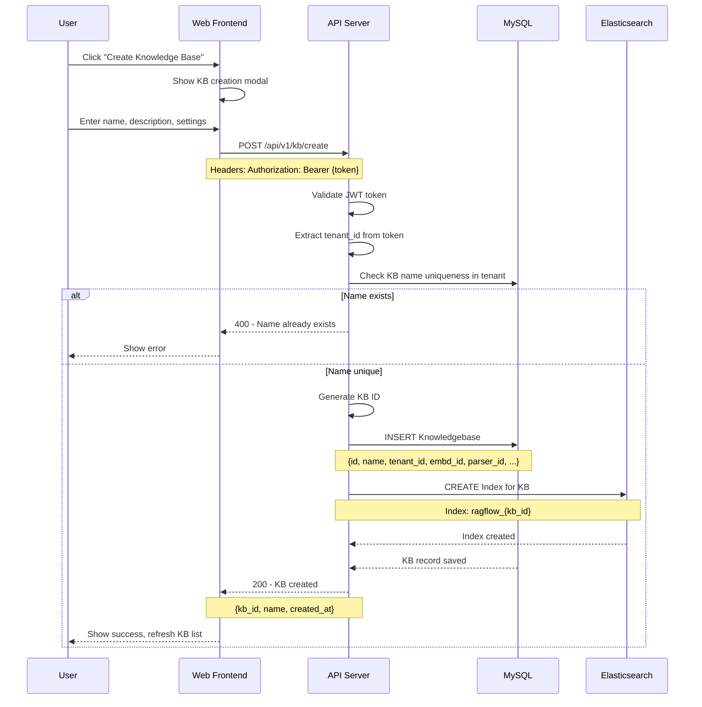
```mermaid
sequenceDiagram
    participant U as User
    participant W as Web Frontend
    participant A as API Server
    participant DB as MySQL
    participant ES as Elasticsearch

    U->>W: Click "Create Knowledge Base"
    W->>W: Show KB creation modal
    U->>W: Enter name, description, settings
    W->>A: POST /api/v1/kb/create
    Note over W,A: Headers: Authorization: Bearer {token}

    A->>A: Validate JWT token
    A->>A: Extract tenant_id from token
    A->>DB: Check KB name uniqueness in tenant

    alt Name exists
        A-->>W: 400 - Name already exists
        W-->>U: Show error
    else Name unique
        A->>A: Generate KB ID
        A->>DB: INSERT Knowledgebase
        Note over A,DB: {id, name, tenant_id, embd_id, parser_id, ...}

        A->>ES: CREATE Index for KB
        Note over A,ES: Index: ragflow_{kb_id}
        ES-->>A: Index created

        DB-->>A: KB record saved
        A-->>W: 200 - KB created
        Note over A,W: {kb_id, name, created_at}
        W-->>U: Show success, refresh KB list
    end
```

### 2.2 List Knowledge Bases

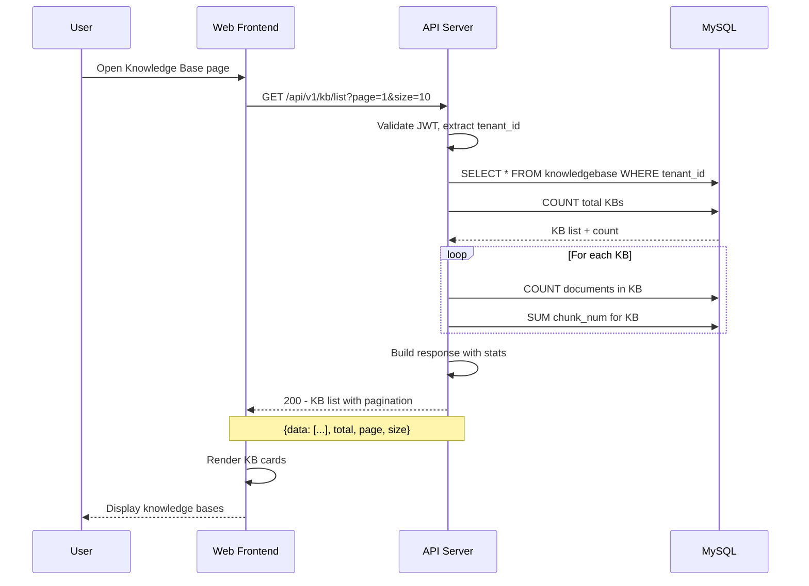
```mermaid
sequenceDiagram
    participant U as User
    participant W as Web Frontend
    participant A as API Server
    participant DB as MySQL

    U->>W: Open Knowledge Base page
    W->>A: GET /api/v1/kb/list?page=1&size=10

    A->>A: Validate JWT, extract tenant_id
    A->>DB: SELECT * FROM knowledgebase WHERE tenant_id
    A->>DB: COUNT total KBs

    DB-->>A: KB list + count

    loop For each KB
        A->>DB: COUNT documents in KB
        A->>DB: SUM chunk_num for KB
    end

    A->>A: Build response with stats
    A-->>W: 200 - KB list with pagination
    Note over A,W: {data: [...], total, page, size}

    W->>W: Render KB cards
    W-->>U: Display knowledge bases
```

## 3. Document Upload & Processing

### 3.1 Document Upload Flow

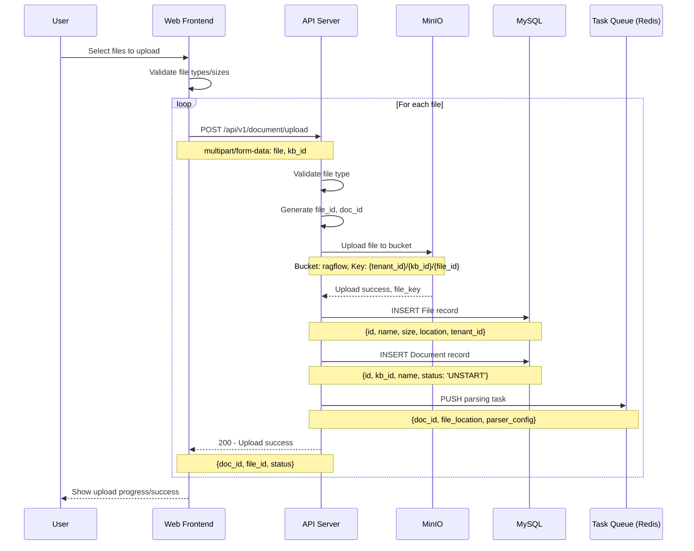
```mermaid
sequenceDiagram
    participant U as User
    participant W as Web Frontend
    participant A as API Server
    participant M as MinIO
    participant DB as MySQL
    participant Q as Task Queue (Redis)

    U->>W: Select files to upload
    W->>W: Validate file types/sizes

    loop For each file
        W->>A: POST /api/v1/document/upload
        Note over W,A: multipart/form-data: file, kb_id

        A->>A: Validate file type
        A->>A: Generate file_id, doc_id

        A->>M: Upload file to bucket
        Note over A,M: Bucket: ragflow, Key: {tenant_id}/{kb_id}/{file_id}
        M-->>A: Upload success, file_key

        A->>DB: INSERT File record
        Note over A,DB: {id, name, size, location, tenant_id}

        A->>DB: INSERT Document record
        Note over A,DB: {id, kb_id, name, status: 'UNSTART'}

        A->>Q: PUSH parsing task
        Note over A,Q: {doc_id, file_location, parser_config}

        A-->>W: 200 - Upload success
        Note over A,W: {doc_id, file_id, status}
    end

    W-->>U: Show upload progress/success
```

### 3.2 Document Parsing Flow (Background Task)

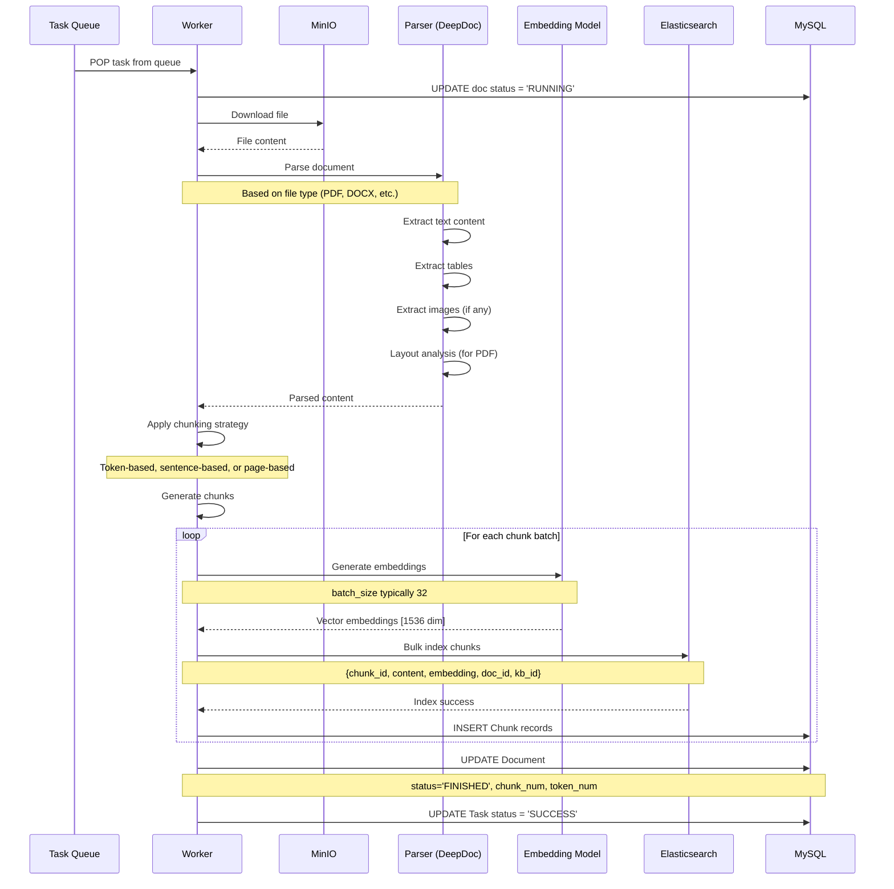
```mermaid
sequenceDiagram
    participant Q as Task Queue
    participant W as Worker
    participant M as MinIO
    participant P as Parser (DeepDoc)
    participant E as Embedding Model
    participant ES as Elasticsearch
    participant DB as MySQL

    Q->>W: POP task from queue
    W->>DB: UPDATE doc status = 'RUNNING'

    W->>M: Download file
    M-->>W: File content

    W->>P: Parse document
    Note over W,P: Based on file type (PDF, DOCX, etc.)

    P->>P: Extract text content
    P->>P: Extract tables
    P->>P: Extract images (if any)
    P->>P: Layout analysis (for PDF)
    P-->>W: Parsed content

    W->>W: Apply chunking strategy
    Note over W: Token-based, sentence-based, or page-based

    W->>W: Generate chunks

    loop For each chunk batch
        W->>E: Generate embeddings
        Note over W,E: batch_size typically 32
        E-->>W: Vector embeddings [1536 dim]

        W->>ES: Bulk index chunks
        Note over W,ES: {chunk_id, content, embedding, doc_id, kb_id}
        ES-->>W: Index success

        W->>DB: INSERT Chunk records
    end

    W->>DB: UPDATE Document
    Note over W,DB: status='FINISHED', chunk_num, token_num

    W->>DB: UPDATE Task status = 'SUCCESS'
```

## 4. Chat/Dialog Flow

### 4.1 Create Chat Session

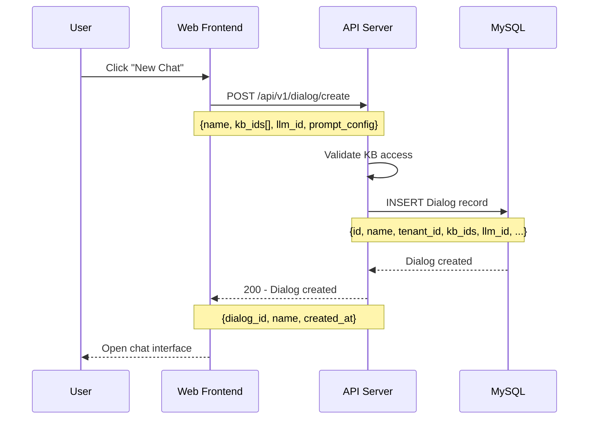
```mermaid
sequenceDiagram
    participant U as User
    participant W as Web Frontend
    participant A as API Server
    participant DB as MySQL

    U->>W: Click "New Chat"
    W->>A: POST /api/v1/dialog/create
    Note over W,A: {name, kb_ids[], llm_id, prompt_config}

    A->>A: Validate KB access
    A->>DB: INSERT Dialog record
    Note over A,DB: {id, name, tenant_id, kb_ids, llm_id, ...}

    DB-->>A: Dialog created
    A-->>W: 200 - Dialog created
    Note over A,W: {dialog_id, name, created_at}

    W-->>U: Open chat interface
```

### 4.2 Chat Message Flow (RAG)

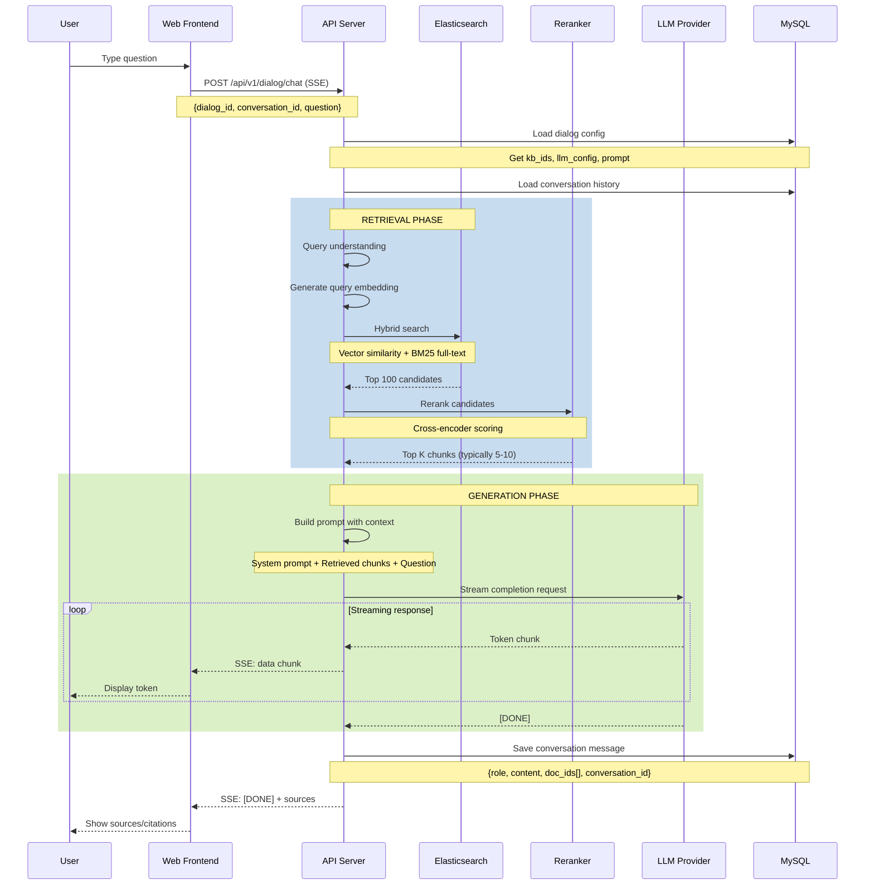
```mermaid
sequenceDiagram
    participant U as User
    participant W as Web Frontend
    participant A as API Server
    participant ES as Elasticsearch
    participant RR as Reranker
    participant LLM as LLM Provider
    participant DB as MySQL

    U->>W: Type question
    W->>A: POST /api/v1/dialog/chat (SSE)
    Note over W,A: {dialog_id, conversation_id, question}

    A->>DB: Load dialog config
    Note over A,DB: Get kb_ids, llm_config, prompt

    A->>DB: Load conversation history

    rect rgb(200, 220, 240)
        Note over A,ES: RETRIEVAL PHASE
        A->>A: Query understanding
        A->>A: Generate query embedding

        A->>ES: Hybrid search
        Note over A,ES: Vector similarity + BM25 full-text
        ES-->>A: Top 100 candidates

        A->>RR: Rerank candidates
        Note over A,RR: Cross-encoder scoring
        RR-->>A: Top K chunks (typically 5-10)
    end

    rect rgb(220, 240, 200)
        Note over A,LLM: GENERATION PHASE
        A->>A: Build prompt with context
        Note over A: System prompt + Retrieved chunks + Question

        A->>LLM: Stream completion request

        loop Streaming response
            LLM-->>A: Token chunk
            A-->>W: SSE: data chunk
            W-->>U: Display token
        end

        LLM-->>A: [DONE]
    end

    A->>DB: Save conversation message
    Note over A,DB: {role, content, doc_ids[], conversation_id}

    A-->>W: SSE: [DONE] + sources
    W-->>U: Show sources/citations
```

### 4.3 Streaming Response Detail

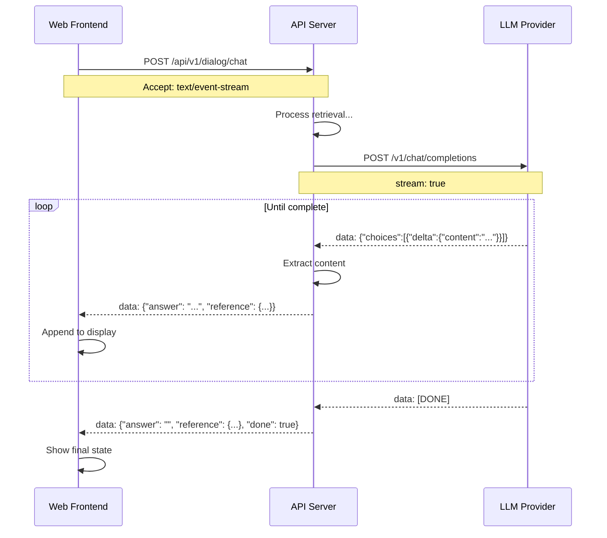
```mermaid
sequenceDiagram
    participant W as Web Frontend
    participant A as API Server
    participant LLM as LLM Provider

    W->>A: POST /api/v1/dialog/chat
    Note over W,A: Accept: text/event-stream

    A->>A: Process retrieval...

    A->>LLM: POST /v1/chat/completions
    Note over A,LLM: stream: true

    loop Until complete
        LLM-->>A: data: {"choices":[{"delta":{"content":"..."}}]}
        A->>A: Extract content
        A-->>W: data: {"answer": "...", "reference": {...}}
        W->>W: Append to display
    end

    LLM-->>A: data: [DONE]
    A-->>W: data: {"answer": "", "reference": {...}, "done": true}
    W->>W: Show final state
```

## 5. Agent Workflow Execution

### 5.1 Canvas Workflow Execution

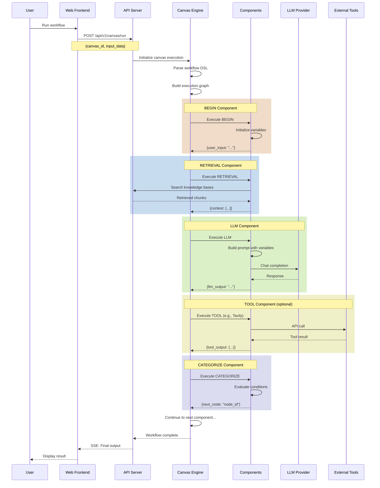
```mermaid
sequenceDiagram
    participant U as User
    participant W as Web Frontend
    participant A as API Server
    participant C as Canvas Engine
    participant Comp as Components
    participant LLM as LLM Provider
    participant Tools as External Tools

    U->>W: Run workflow
    W->>A: POST /api/v1/canvas/run
    Note over W,A: {canvas_id, input_data}

    A->>C: Initialize canvas execution
    C->>C: Parse workflow DSL
    C->>C: Build execution graph

    rect rgb(240, 220, 200)
        Note over C,Comp: BEGIN Component
        C->>Comp: Execute BEGIN
        Comp->>Comp: Initialize variables
        Comp-->>C: {user_input: "..."}
    end

    rect rgb(200, 220, 240)
        Note over C,Comp: RETRIEVAL Component
        C->>Comp: Execute RETRIEVAL
        Comp->>A: Search knowledge bases
        A-->>Comp: Retrieved chunks
        Comp-->>C: {context: [...]}
    end

    rect rgb(220, 240, 200)
        Note over C,LLM: LLM Component
        C->>Comp: Execute LLM
        Comp->>Comp: Build prompt with variables
        Comp->>LLM: Chat completion
        LLM-->>Comp: Response
        Comp-->>C: {llm_output: "..."}
    end

    rect rgb(240, 240, 200)
        Note over C,Tools: TOOL Component (optional)
        C->>Comp: Execute TOOL (e.g., Tavily)
        Comp->>Tools: API call
        Tools-->>Comp: Tool result
        Comp-->>C: {tool_output: {...}}
    end

    rect rgb(220, 220, 240)
        Note over C,Comp: CATEGORIZE Component
        C->>Comp: Execute CATEGORIZE
        Comp->>Comp: Evaluate conditions
        Comp-->>C: {next_node: "node_id"}
    end

    C->>C: Continue to next component...

    C-->>A: Workflow complete
    A-->>W: SSE: Final output
    W-->>U: Display result
```

### 5.2 Agent with Tools Flow

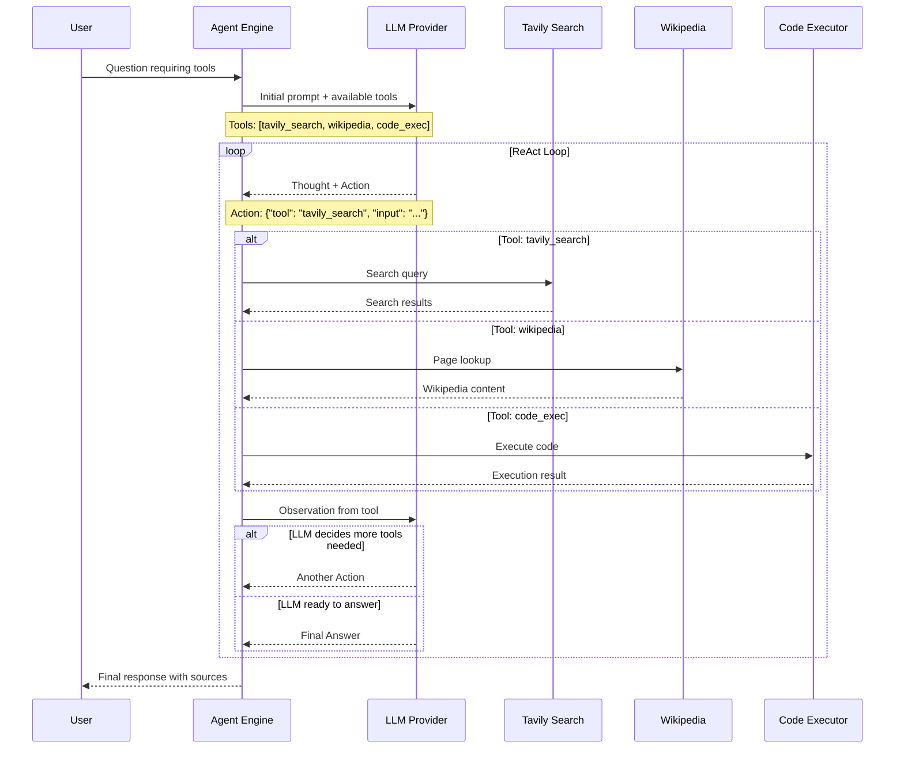
```mermaid
sequenceDiagram
    participant U as User
    participant A as Agent Engine
    participant LLM as LLM Provider
    participant T1 as Tavily Search
    participant T2 as Wikipedia
    participant T3 as Code Executor

    U->>A: Question requiring tools

    A->>LLM: Initial prompt + available tools
    Note over A,LLM: Tools: [tavily_search, wikipedia, code_exec]

    loop ReAct Loop
        LLM-->>A: Thought + Action
        Note over LLM,A: Action: {"tool": "tavily_search", "input": "..."}

        alt Tool: tavily_search
            A->>T1: Search query
            T1-->>A: Search results
        else Tool: wikipedia
            A->>T2: Page lookup
            T2-->>A: Wikipedia content
        else Tool: code_exec
            A->>T3: Execute code
            T3-->>A: Execution result
        end

        A->>LLM: Observation from tool

        alt LLM decides more tools needed
            LLM-->>A: Another Action
        else LLM ready to answer
            LLM-->>A: Final Answer
        end
    end

    A-->>U: Final response with sources
```

## 6. GraphRAG Flow

### 6.1 Knowledge Graph Construction

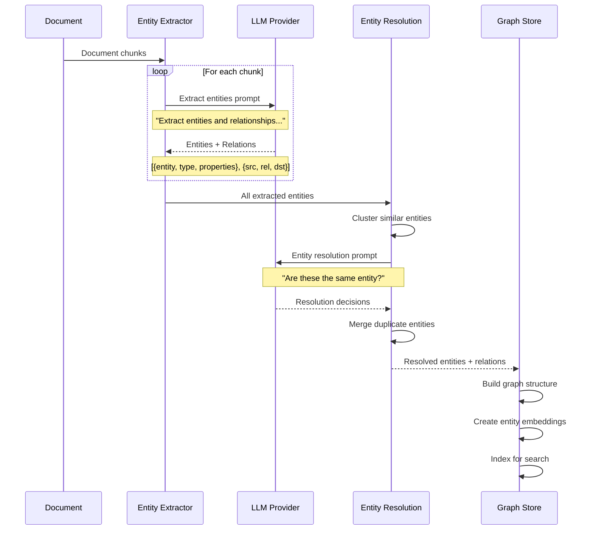
```mermaid
sequenceDiagram
    participant D as Document
    participant E as Entity Extractor
    participant LLM as LLM Provider
    participant ER as Entity Resolution
    participant G as Graph Store

    D->>E: Document chunks

    loop For each chunk
        E->>LLM: Extract entities prompt
        Note over E,LLM: "Extract entities and relationships..."
        LLM-->>E: Entities + Relations
        Note over LLM,E: [{entity, type, properties}, {src, rel, dst}]
    end

    E->>ER: All extracted entities

    ER->>ER: Cluster similar entities
    ER->>LLM: Entity resolution prompt
    Note over ER,LLM: "Are these the same entity?"
    LLM-->>ER: Resolution decisions

    ER->>ER: Merge duplicate entities
    ER-->>G: Resolved entities + relations

    G->>G: Build graph structure
    G->>G: Create entity embeddings
    G->>G: Index for search
```

### 6.2 GraphRAG Query Flow

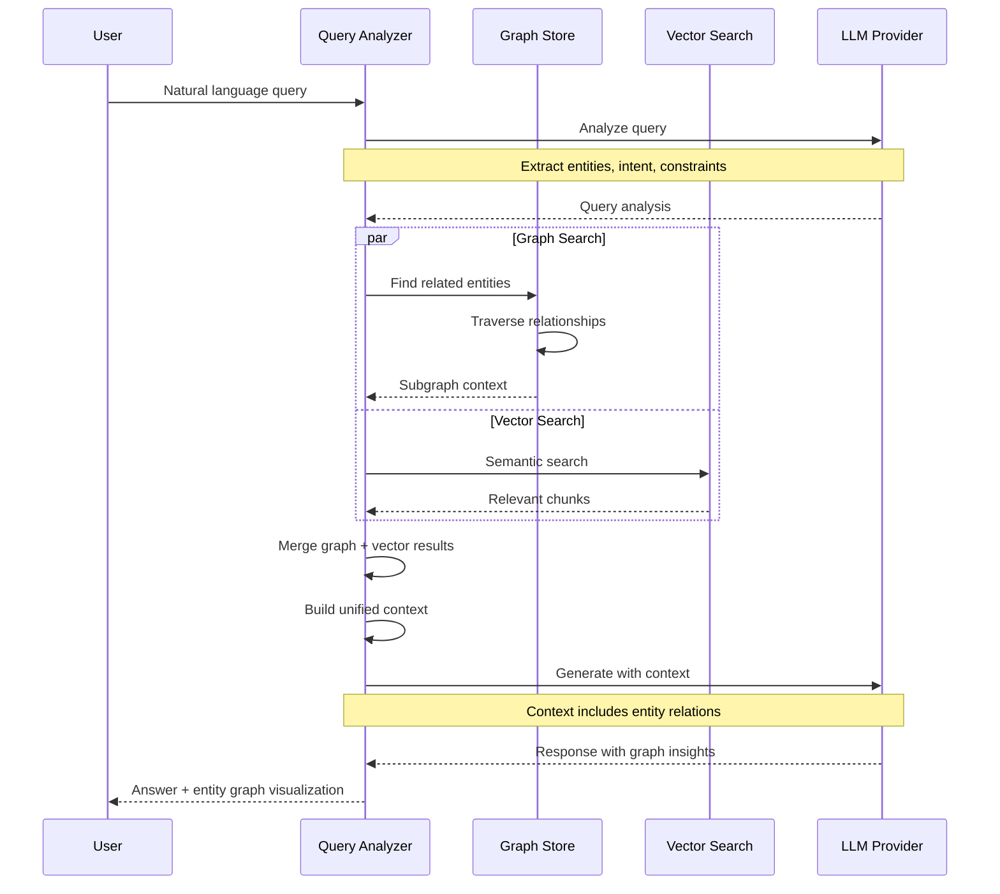
```mermaid
sequenceDiagram
    participant U as User
    participant Q as Query Analyzer
    participant G as Graph Store
    participant V as Vector Search
    participant LLM as LLM Provider

    U->>Q: Natural language query

    Q->>LLM: Analyze query
    Note over Q,LLM: Extract entities, intent, constraints
    LLM-->>Q: Query analysis

    par Graph Search
        Q->>G: Find related entities
        G->>G: Traverse relationships
        G-->>Q: Subgraph context
    and Vector Search
        Q->>V: Semantic search
        V-->>Q: Relevant chunks
    end

    Q->>Q: Merge graph + vector results
    Q->>Q: Build unified context

    Q->>LLM: Generate with context
    Note over Q,LLM: Context includes entity relations
    LLM-->>Q: Response with graph insights

    Q-->>U: Answer + entity graph visualization
```

## 7. File Operations

### 7.1 File Download Flow

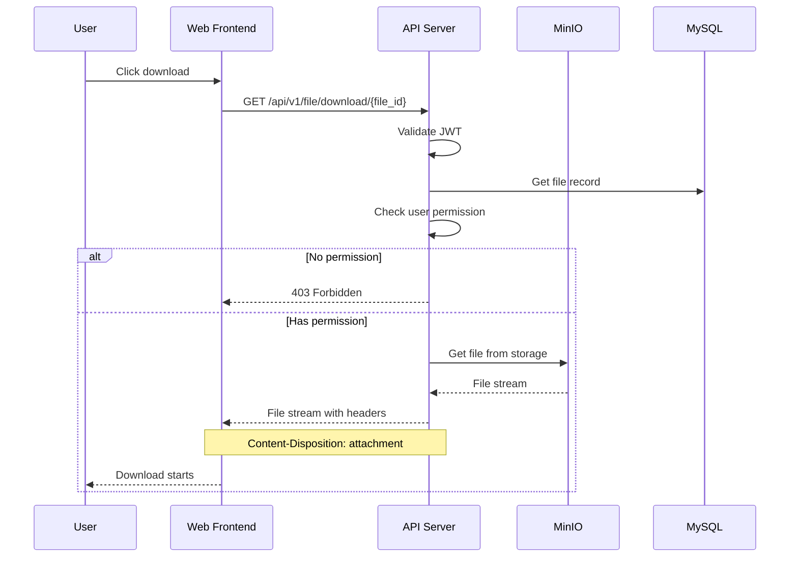
```mermaid
sequenceDiagram
    participant U as User
    participant W as Web Frontend
    participant A as API Server
    participant M as MinIO
    participant DB as MySQL

    U->>W: Click download
    W->>A: GET /api/v1/file/download/{file_id}

    A->>A: Validate JWT
    A->>DB: Get file record
    A->>A: Check user permission

    alt No permission
        A-->>W: 403 Forbidden
    else Has permission
        A->>M: Get file from storage
        M-->>A: File stream
        A-->>W: File stream with headers
        Note over A,W: Content-Disposition: attachment
        W-->>U: Download starts
    end
```

## 8. Search Operations

### 8.1 Hybrid Search Flow

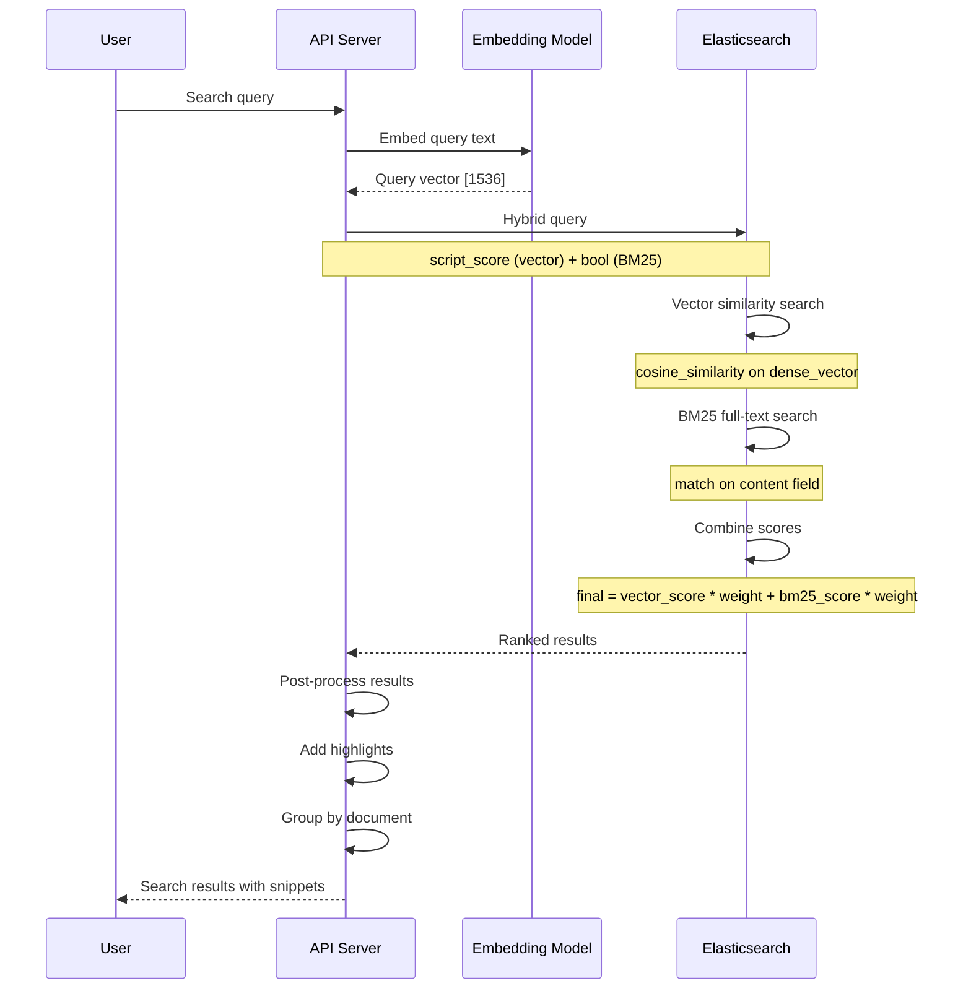
```mermaid
sequenceDiagram
    participant U as User
    participant A as API Server
    participant E as Embedding Model
    participant ES as Elasticsearch

    U->>A: Search query

    A->>E: Embed query text
    E-->>A: Query vector [1536]

    A->>ES: Hybrid query
    Note over A,ES: script_score (vector) + bool (BM25)

    ES->>ES: Vector similarity search
    Note over ES: cosine_similarity on dense_vector

    ES->>ES: BM25 full-text search
    Note over ES: match on content field

    ES->>ES: Combine scores
    Note over ES: final = vector_score * weight + bm25_score * weight

    ES-->>A: Ranked results

    A->>A: Post-process results
    A->>A: Add highlights
    A->>A: Group by document

    A-->>U: Search results with snippets
```

## 9. Multi-Tenancy Flow

### 9.1 Tenant Data Isolation

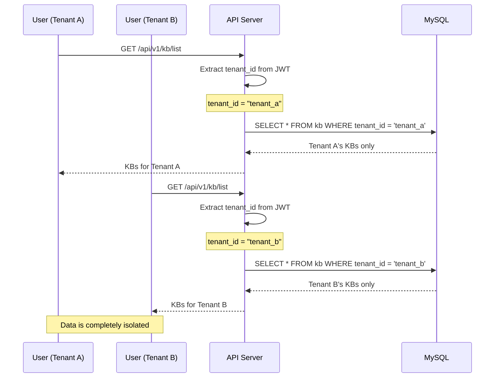
```mermaid
sequenceDiagram
    participant U1 as User (Tenant A)
    participant U2 as User (Tenant B)
    participant A as API Server
    participant DB as MySQL

    U1->>A: GET /api/v1/kb/list
    A->>A: Extract tenant_id from JWT
    Note over A: tenant_id = "tenant_a"
    A->>DB: SELECT * FROM kb WHERE tenant_id = 'tenant_a'
    DB-->>A: Tenant A's KBs only
    A-->>U1: KBs for Tenant A

    U2->>A: GET /api/v1/kb/list
    A->>A: Extract tenant_id from JWT
    Note over A: tenant_id = "tenant_b"
    A->>DB: SELECT * FROM kb WHERE tenant_id = 'tenant_b'
    DB-->>A: Tenant B's KBs only
    A-->>U2: KBs for Tenant B

    Note over U1,U2: Data is completely isolated
```

## 10. Connector Integration Flow

### 10.1 Confluence Connector Sync

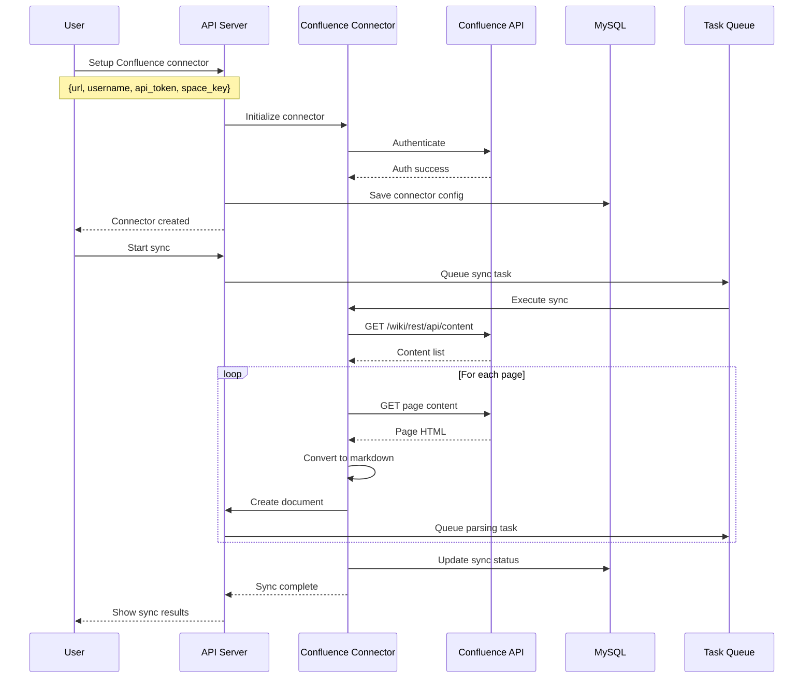
```mermaid
sequenceDiagram
    participant U as User
    participant A as API Server
    participant C as Confluence Connector
    participant CF as Confluence API
    participant DB as MySQL
    participant Q as Task Queue

    U->>A: Setup Confluence connector
    Note over U,A: {url, username, api_token, space_key}

    A->>C: Initialize connector
    C->>CF: Authenticate
    CF-->>C: Auth success

    A->>DB: Save connector config
    A-->>U: Connector created

    U->>A: Start sync
    A->>Q: Queue sync task

    Q->>C: Execute sync
    C->>CF: GET /wiki/rest/api/content
    CF-->>C: Content list

    loop For each page
        C->>CF: GET page content
        CF-->>C: Page HTML
        C->>C: Convert to markdown
        C->>A: Create document
        A->>Q: Queue parsing task
    end

    C->>DB: Update sync status
    C-->>A: Sync complete
    A-->>U: Show sync results
```

## Tóm Tắt

| Flow | Thành phần chính | Mô tả |
|------|-----------------|-------|
| Authentication | User, API, DB, Redis | Đăng ký, đăng nhập với JWT |
| Knowledge Base | API, MySQL, ES | CRUD knowledge bases |
| Document Upload | API, MinIO, Queue, ES | Upload và index documents |
| Chat/Dialog | API, ES, Reranker, LLM | RAG-based chat với streaming |
| Agent Workflow | Canvas Engine, Components, LLM, Tools | Visual workflow execution |
| GraphRAG | Entity Extractor, Graph Store, LLM | Knowledge graph queries |
| Search | Embedding, ES | Hybrid vector + BM25 search |
| Connectors | Connector, External API | Sync external data sources |

### Các Pattern Thiết Kế Sử Dụng

1. **Event-Driven**: Task queue cho background processing
2. **Streaming**: SSE cho real-time chat responses
3. **Hybrid Search**: Kết hợp vector và text search
4. **ReAct Pattern**: Agent reasoning với tool use
5. **Multi-Tenancy**: Data isolation per tenant
