# MonkeyOCR Implementation Files & Architecture

## Complete File List for Phases 1-4

### 📋 Summary
- **New Files**: 3
- **Modified Files**: 6  
- **MonkeyOCR Source**: 1 folder (contains entire MonkeyOCR codebase)
- **Total Files**: 9 + MonkeyOCR source code

---

## Architecture Overview

### 🏗️ System Architecture


### 🔄 Sequence Diagram


### 📁 File Dependencies & Implementation Flow

```mermaid
graph TD
    subgraph "File Structure & Dependencies"
        subgraph "Phase 1: Parser Type"
            P1F1["📄 api/db/__init__.py<br/>✏️ MODIFY<br/>+ MONKEY_OCR = \"monkey_ocr\""]
            P1F2["📄 api/db/init_data.py<br/>✏️ MODIFY<br/>+ monkey_ocr:MonkeyOCR"]
        end
        
        subgraph "Phase 2: Parser Implementation"
            P2F1["📄 rag/app/monkey_ocr_parser.py<br/>🆕 NEW<br/>• MonkeyOCRManager class<br/>• chunk() function<br/>• Lazy loading logic"]
            P2F2["📄 rag/app/__init__.py<br/>✏️ MODIFY<br/>+ from .monkey_ocr_parser import chunk<br/>+ FACTORY[MONKEY_OCR] = monkey_ocr_chunk"]
        end
        
        subgraph "Phase 3: File Service"
            P3F1["📄 api/db/services/file_service.py<br/>✏️ MODIFY<br/>+ get_parser() logic for MonkeyOCR"]
        end
        
        subgraph "Phase 4: Configuration"
            P4F1["📄 conf/monkey_ocr_config.json<br/>🆕 NEW<br/>• Model variants<br/>• Default settings<br/>• File size limits"]
            P4F2["📄 api/settings.py<br/>✏️ MODIFY<br/>+ MONKEY_OCR_CONFIG"]
        end
        
        subgraph "Dependencies & Source"
            DEP1["📁 monkeyocr/<br/>Local MonkeyOCR source code"]
            DEP2["📦 PyTorch >= 2.0.0"]
            DEP3["📦 Transformers >= 4.30.0"]
            DEP4["📦 Pillow >= 9.0.0"]
            DEP5["📦 OpenCV >= 4.5.0"]
        end
    end
    
    %% Dependencies between phases
    P1F1 --> P2F2
    P1F1 --> P3F1
    P2F1 --> P2F2
    P4F1 --> P4F2
    P4F2 --> P2F1
    
    %% External dependencies
    DEP1 --> P2F1
    DEP2 --> P2F1
    DEP3 --> P2F1
    DEP4 --> P2F1
    DEP5 --> P2F1
    
    %% Implementation order
    P1F1 -.->|"Step 1"| P1F2
    P1F2 -.->|"Step 2"| P2F1
    P2F1 -.->|"Step 3"| P2F2
    P2F2 -.->|"Step 4"| P3F1
    P3F1 -.->|"Step 5"| P4F1
    P4F1 -.->|"Step 6"| P4F2
    
    %% Styling
    classDef newFile fill:#e8f5e8,stroke:#2e7d32,stroke-width:2px
    classDef modFile fill:#fff3e0,stroke:#ef6c00,stroke-width:2px
    classDef depFile fill:#f3e5f5,stroke:#7b1fa2,stroke-width:2px
    classDef orderFlow stroke:#1976d2,stroke-width:2px,stroke-dasharray: 5 5
    
    class P2F1,P4F1 newFile
    class P1F1,P1F2,P2F2,P3F1,P4F2 modFile
    class DEP1,DEP2,DEP3,DEP4,DEP5 depFile
```



---

## 📁 MonkeyOCR Source Code Integration

### 🎯 **MonkeyOCR Folder Structure**
We'll include the MonkeyOCR source code directly in the RAGFlow project:

```
ragflow/
├── monkeyocr/                    # 🆕 MonkeyOCR source code folder
│   ├── __init__.py              # Python package initialization
│   ├── magic_pdf/               # Core MonkeyOCR modules
│   │   ├── pipe/
│   │   │   ├── UNIPipe.py
│   │   │   ├── OCRPipe.py
│   │   │   └── ...
│   │   └── ...
│   ├── requirements.txt         # MonkeyOCR dependencies
│   ├── setup.py                # MonkeyOCR setup script
│   └── README.md               # MonkeyOCR documentation
├── deepdoc/
│   └── vision/
│       └── monkey_ocr.py       # RAGFlow integration wrapper
└── ...
```

### 🔄 **Integration Approach**
1. **Local Source**: MonkeyOCR source code included in `monkeyocr/` folder
2. **Wrapper Class**: `deepdoc/vision/monkey_ocr.py` wraps the local MonkeyOCR
3. **Direct Imports**: Import from local `monkeyocr` package instead of external dependency
4. **Version Control**: MonkeyOCR source tracked as part of RAGFlow project

### 📦 **Installation Steps**
```bash
# Clone MonkeyOCR into ragflow/monkeyocr/
cd ragflow/
git clone https://github.com/Yuliang-Liu/MonkeyOCR.git monkeyocr/

# Install MonkeyOCR dependencies
cd monkeyocr/
pip install -r requirements.txt

# Install MonkeyOCR in development mode
pip install -e .
```

---

## 🏗️ Updated Architecture with Deepdoc Integration

The implementation plan has been updated to properly integrate MonkeyOCR into RAGFlow's `deepdoc` module structure:

### 📐 **Proper Integration Structure**
- **`deepdoc/vision/`**: Core OCR and vision components (where MonkeyOCR belongs)
- **`deepdoc/parser/`**: Document parsers for different file types
- **`rag/app/`**: High-level chunking logic that uses deepdoc components

### 🎯 **Why This Architecture is Better**
1. **Follows RAGFlow Patterns**: MonkeyOCR sits alongside existing OCR in `deepdoc.vision`
2. **Proper Separation**: Vision component in `deepdoc`, chunking logic in `rag/app`
3. **Reusable**: MonkeyOCR can be used by multiple parsers/components
4. **Maintainable**: Clear module boundaries and responsibilities

### 🔄 **Integration Flow**
```
deepdoc.vision.MonkeyOCR → rag.app.monkey_ocr_parser → FACTORY → API
```

---

## Phase 1: Add MonkeyOCR as Parser Type

### 🔧 Files to Modify

#### 1. `api/db/__init__.py`
**Action**: ✏️ MODIFY - Add new parser type to enum
```python
class ParserType(StrEnum):
    PRESENTATION = "presentation"
    LAWS = "laws"
    MANUAL = "manual"
    PAPER = "paper"
    RESUME = "resume"
    BOOK = "book"
    QA = "qa"
    TABLE = "table"
    NAIVE = "naive"
    PICTURE = "picture"
    ONE = "one"
    AUDIO = "audio"
    EMAIL = "email"
    KG = "knowledge_graph"
    TAG = "tag"
    MONKEY_OCR = "monkey_ocr"  # 🆕 ADD THIS LINE
```

#### 2. `api/db/init_data.py`
**Action**: ✏️ MODIFY - Add to parser options
```python
# Find the TenantService.filter_update call and update parser_ids
TenantService.filter_update([1 == 1], {
    "parser_ids": "naive:General,qa:Q&A,resume:Resume,manual:Manual,table:Table,paper:Paper,book:Book,laws:Laws,presentation:Presentation,picture:Picture,one:One,audio:Audio,email:Email,tag:Tag,monkey_ocr:MonkeyOCR"
    # 🆕 ADD: ,monkey_ocr:MonkeyOCR
})
```

---

## Phase 2: Create MonkeyOCR Parser

### 📄 New Files

#### 1. `deepdoc/vision/monkey_ocr.py`
**Action**: 🆕 NEW FILE - MonkeyOCR vision component (follows deepdoc pattern)
```python
"""
MonkeyOCR integration for RAGFlow.
Provides advanced OCR with structure recognition and relationship prediction.
"""
import io
import re
import tempfile
import os
import logging
import numpy as np
from PIL import Image
from api import settings

logger = logging.getLogger(__name__)

class MonkeyOCR:
    """
    MonkeyOCR class following deepdoc/vision pattern.
    Integrates with RAGFlow's vision module architecture.
    """
    
    def __init__(self, model_dir=None):
        """
        Initialize MonkeyOCR with on-demand loading.
        Model is loaded for each task and unloaded to free memory.
        """
        self.model = None
        self.model_dir = model_dir
        self.config = getattr(settings, 'MONKEY_OCR_CONFIG', {})
    
    def load_model(self):
        """
        Load MonkeyOCR model for current task.
        Model is loaded fresh each time to ensure clean state.
        """
        try:
            logger.info("Loading MonkeyOCR model for task...")
            # Import from local MonkeyOCR source code
            from monkeyocr.magic_pdf.pipe.UNIPipe import UNIPipe
            from monkeyocr.magic_pdf.pipe.OCRPipe import OCRPipe
            
            # Initialize MonkeyOCR pipeline
            self.model = UNIPipe(
                pdf_res_path=self.model_dir,
                model_type=self.config.get('default_config', {}).get('model_variant', 'pro-1.2B')
            )
            logger.info("MonkeyOCR model loaded successfully")
        except Exception as e:
            logger.error(f"Failed to load MonkeyOCR model: {e}")
            raise
    
    def unload_model(self):
        """
        Unload MonkeyOCR model to free memory.
        Called after each task completion.
        """
        try:
            if self.model is not None:
                logger.info("Unloading MonkeyOCR model to free memory...")
                # Clean up model resources
                if hasattr(self.model, 'cleanup'):
                    self.model.cleanup()
                
                # Clear model reference
                self.model = None
                
                # Force garbage collection to free memory
                import gc
                gc.collect()
                
                logger.info("MonkeyOCR model unloaded successfully")
        except Exception as e:
            logger.warning(f"Error during model unloading: {e}")
            # Set to None anyway to prevent further usage
            self.model = None
    
    def __call__(self, img_path, config=None):
        """
        Process image/document using MonkeyOCR.
        Follows the same pattern as existing OCR class.
        Implements load → process → unload cycle for memory efficiency.
        
        Args:
            img_path (str): Path to the image/document file
            config (dict): Processing configuration options
            
        Returns:
            list: List of (bbox, (text, confidence)) tuples
        """
        # Load model for this task
        self.load_model()
        
        try:
            # Process with MonkeyOCR
            if isinstance(img_path, str):
                # File path
                result = self.model.pipe_analyze(img_path)
            else:
                # Image array
                with tempfile.NamedTemporaryFile(suffix='.png', delete=False) as tmp:
                    Image.fromarray(img_path).save(tmp.name)
                    result = self.model.pipe_analyze(tmp.name)
                    os.unlink(tmp.name)
            
            # Convert to RAGFlow OCR format: list of (bbox, (text, confidence))
            ocr_results = []
            if result.get('layout_dets'):
                for detection in result['layout_dets']:
                    bbox = detection.get('bbox', [0, 0, 0, 0])
                    text = detection.get('text', '')
                    confidence = detection.get('score', 1.0)
                    
                    # Convert bbox format if needed
                    if len(bbox) == 4:
                        # Convert to format expected by RAGFlow
                        bbox_coords = np.array([
                            [bbox[0], bbox[1]],  # top-left
                            [bbox[2], bbox[1]],  # top-right
                            [bbox[2], bbox[3]],  # bottom-right
                            [bbox[0], bbox[3]]   # bottom-left
                        ])
                        ocr_results.append((bbox_coords, (text, confidence)))
            
            return ocr_results
            
        except Exception as e:
            logger.error(f"MonkeyOCR processing failed: {e}")
            return []
        finally:
            # Always unload model to free memory
            self.unload_model()
    
    def get_markdown_result(self, file_path, config=None):
        """
        Get markdown formatted result from MonkeyOCR.
        Additional method for structured output.
        Implements load → process → unload cycle for memory efficiency.
        
        Args:
            file_path (str): Path to the document file
            config (dict): Processing configuration
            
        Returns:
            dict: Result with markdown content and structure info
        """
        # Load model for this task
        self.load_model()
        
        try:
            result = self.model.pipe_analyze(file_path)
            
            # Extract markdown and structure information
            markdown_content = result.get('content_list', [])
            structure_info = result.get('layout_dets', [])
            
            return {
                'markdown': '\n'.join(markdown_content) if markdown_content else '',
                'structure': structure_info,
                'metadata': result.get('metadata', {})
            }
            
        except Exception as e:
            logger.error(f"MonkeyOCR markdown extraction failed: {e}")
            return {'markdown': '', 'structure': [], 'metadata': {}}
        finally:
            # Always unload model to free memory
            self.unload_model()
```

#### 2. `rag/app/monkey_ocr_parser.py`
**Action**: 🆕 NEW FILE - High-level chunking logic using deepdoc MonkeyOCR
```python
"""
MonkeyOCR parser for RAGFlow knowledge base integration.
Uses deepdoc.vision.MonkeyOCR for document processing.
"""
import io
import re
import tempfile
import os
import logging
from PIL import Image
from api.db import LLMType
from api.db.services.llm_service import LLMBundle
from rag.nlp import tokenize, rag_tokenizer
from deepdoc.vision import MonkeyOCR

logger = logging.getLogger(__name__)

def chunk(filename, binary=None, from_page=0, to_page=100000,
          lang="Chinese", callback=None, **kwargs):
    """
    Parse document using MonkeyOCR for knowledge base creation.
    Supports PDF and image files with advanced structure recognition.
    
    Args:
        filename (str): Name of the file being processed
        binary (bytes): File binary content
        from_page (int): Starting page (for PDF pagination)
        to_page (int): Ending page (for PDF pagination)
        lang (str): Document language
        callback (function): Progress callback function
        **kwargs: Additional configuration options
        
    Returns:
        list: Array of document chunks in RAGFlow format
    """
    def safe_callback(progress, message):
        if callback:
            callback(progress, message)
    
    safe_callback(0.1, "Initializing MonkeyOCR...")
    
    # Initialize MonkeyOCR from deepdoc.vision
    monkey_ocr = MonkeyOCR()
    
    # Prepare document
    if binary:
        # Save binary to temporary file
        with tempfile.NamedTemporaryFile(
            delete=False, 
            suffix=os.path.splitext(filename)[1]
        ) as tmp_file:
            tmp_file.write(binary)
            temp_path = tmp_file.name
    else:
        temp_path = filename
    
    try:
        safe_callback(0.2, "Processing document with MonkeyOCR...")
        
        # Process with MonkeyOCR
        config = kwargs.get("parser_config", {})
        result = monkey_ocr.get_markdown_result(temp_path, config)
        
        safe_callback(0.8, "Formatting results for knowledge base...")
        
        # Convert to RAGFlow format
        doc = {
            "docnm_kwd": filename,
            "title_tks": rag_tokenizer.tokenize(
                re.sub(r"\.[a-zA-Z]+$", "", filename)
            ),
            "doc_type_kwd": "monkey_ocr"
        }
        
        # Process markdown output from MonkeyOCR
        if result.get("markdown"):
            eng = lang.lower() == "english"
            tokenize(doc, result["markdown"], eng)
            
            # Add structure information if available
            if result.get("structure"):
                doc["structure_info"] = result["structure"]
            
            # Add metadata if available
            if result.get("metadata"):
                doc["metadata"] = result["metadata"]
            
            safe_callback(1.0, "MonkeyOCR processing complete")
            return [doc]
        else:
            logger.warning("MonkeyOCR returned no markdown content")
            return []
        
    except Exception as e:
        safe_callback(-1, f"MonkeyOCR processing failed: {str(e)}")
        logger.error(f"Error processing {filename}: {e}")
        # Return empty list to allow graceful fallback
        return []
        
    finally:
        # Clean up temporary file
        if binary and os.path.exists(temp_path):
            try:
                os.unlink(temp_path)
            except OSError as e:
                logger.warning(f"Failed to cleanup temp file {temp_path}: {e}")
```

### 🔧 Files to Modify

#### 3. `deepdoc/vision/__init__.py`
**Action**: ✏️ MODIFY - Expose MonkeyOCR in vision module
```python
from .ocr import OCR
from .recognizer import Recognizer
from .layout_recognizer import LayoutRecognizer4YOLOv10 as LayoutRecognizer
from .table_structure_recognizer import TableStructureRecognizer
from .monkey_ocr import MonkeyOCR  # 🆕 ADD THIS LINE

# ... existing code ...

__all__ = [
    "OCR",
    "Recognizer", 
    "LayoutRecognizer",
    "TableStructureRecognizer",
    "MonkeyOCR",  # 🆕 ADD THIS LINE
    "init_in_out",
]
```

#### 4. `rag/app/__init__.py`
**Action**: ✏️ MODIFY - Add MonkeyOCR to parser factory
```python
# Add import at the top with other parser imports
from .monkey_ocr_parser import chunk as monkey_ocr_chunk

# Update the FACTORY dictionary
FACTORY = {
    ParserType.PRESENTATION.value: presentation,
    ParserType.PICTURE.value: picture, 
    ParserType.AUDIO.value: audio, 
    ParserType.EMAIL.value: email,
    ParserType.MONKEY_OCR.value: monkey_ocr_chunk,  # 🆕 ADD THIS LINE
}
```

---

## Phase 3: Update File Service

### 🔧 Files to Modify

#### 1. `api/db/services/file_service.py`
**Action**: ✏️ MODIFY - Update parser selection logic
```python
@staticmethod
def get_parser(doc_type, filename, default):
    """Get appropriate parser for document type and filename."""
    if doc_type == FileType.VISUAL:
        return ParserType.PICTURE.value
    if doc_type == FileType.AURAL:
        return ParserType.AUDIO.value
    if re.search(r"\.(ppt|pptx|pages)$", filename):
        return ParserType.PRESENTATION.value
    if re.search(r"\.(eml)$", filename):
        return ParserType.EMAIL.value
    
    # 🆕 ADD: MonkeyOCR for supported file types
    if re.search(r"\.(pdf|png|jpg|jpeg)$", filename):
        # Check if MonkeyOCR is configured as default
        if default == ParserType.MONKEY_OCR.value:
            return ParserType.MONKEY_OCR.value
    
    return default
```

---

## Phase 4: Configuration Support

### 📄 New Files

#### 1. `conf/monkey_ocr_config.json`
**Action**: 🆕 NEW FILE - MonkeyOCR configuration schema
```json
{
  "monkey_ocr": {
    "default_config": {
      "model_variant": "pro-1.2B",
      "output_format": "markdown",
      "enable_structure": true,
      "enable_relationships": true,
      "processing_mode": "balanced"
    },
    "performance": {
      "max_file_size": "50MB",
      "timeout": 300,
      "supported_formats": ["pdf", "png", "jpg", "jpeg"]
    },
    "model_settings": {
      "available_variants": ["pro-3B", "pro-1.2B"],
      "default_variant": "pro-1.2B",
      "model_path": "./monkeyocr/models"
    },
    "advanced": {
      "batch_processing": false,
      "cache_results": true,
      "fallback_to_naive": true
    }
  }
}
```

### 🔧 Files to Modify

#### 2. `api/settings.py`
**Action**: ✏️ MODIFY - Add MonkeyOCR configuration
```python
# Add to existing settings (around line 150+ where other configs are loaded)
MONKEY_OCR_CONFIG = get_base_config("monkey_ocr", {
    "default_config": {
        "model_variant": "pro-1.2B",
        "output_format": "markdown",
        "enable_structure": True,
        "enable_relationships": True
    },
    "supported_formats": ["pdf", "png", "jpg", "jpeg"],
    "max_file_size": "50MB"
})
```

---

## Dependencies & Requirements

### 📦 New Dependencies
Add to `requirements.txt`:
```text
# MonkeyOCR dependencies (from local source)
torch>=2.0.0
transformers>=4.30.0
pillow>=9.0.0
opencv-python>=4.5.0
numpy>=1.21.0
# Note: MonkeyOCR source code included in monkeyocr/ folder
```

### 🔧 **MonkeyOCR Setup**
Since we're using MonkeyOCR from local source:
```bash
# Install MonkeyOCR from local source
cd ragflow/monkeyocr/
pip install -e .

# Download required models (if needed)
# Follow MonkeyOCR's model download instructions
```

### 🖥️ System Requirements
- **GPU**: Recommended (CUDA-compatible)
- **Memory**: 8GB+ RAM for model loading
- **Storage**: 
  - 5GB+ for MonkeyOCR model files
  - 500MB+ for MonkeyOCR source code (`monkeyocr/` folder)
- **Python**: 3.8+
- **Git**: Required for cloning MonkeyOCR source

---

## Implementation Order

### ✅ Step-by-Step Implementation

#### **Prerequisites**
**Step 0**: Setup MonkeyOCR source code
```bash
# Clone MonkeyOCR source into ragflow/monkeyocr/
cd ragflow/
git clone https://github.com/Yuliang-Liu/MonkeyOCR.git monkeyocr/

# Install MonkeyOCR dependencies and models
cd monkeyocr/
pip install -r requirements.txt
pip install -e .
```

#### **Implementation Steps**
1. **Step 1**: Modify `api/db/__init__.py` (Add parser type)
2. **Step 2**: Modify `api/db/init_data.py` (Add to parser list)
3. **Step 3**: Create `deepdoc/vision/monkey_ocr.py` (Core MonkeyOCR component)
4. **Step 4**: Modify `deepdoc/vision/__init__.py` (Expose MonkeyOCR)
5. **Step 5**: Create `rag/app/monkey_ocr_parser.py` (High-level chunking logic)
6. **Step 6**: Modify `rag/app/__init__.py` (Add to parser factory)
7. **Step 7**: Modify `api/db/services/file_service.py` (Parser selection)
8. **Step 8**: Create `conf/monkey_ocr_config.json` (Configuration)
9. **Step 9**: Modify `api/settings.py` (Load configuration)

### 🧪 Testing After Each Step
- **After Step 0**: Verify MonkeyOCR source is properly installed
  ```bash
  cd ragflow/
  python -c "from monkeyocr.magic_pdf.pipe.UNIPipe import UNIPipe; print('✅ MonkeyOCR imports working')"
  ```
- **After Steps 1-2**: Verify parser type is recognized
- **After Steps 3-4**: Test MonkeyOCR component in deepdoc.vision
- **After Steps 5-6**: Test parser factory inclusion
- **After Step 7**: Test file type detection
- **After Steps 8-9**: Test configuration loading

---

## Validation Checklist

### ✅ Phase 1 Validation
- [ ] `ParserType.MONKEY_OCR` exists in enum
- [ ] "monkey_ocr" appears in parser_ids string
- [ ] No import errors in modified files

### ✅ Phase 2 Validation  
- [ ] `deepdoc/vision/monkey_ocr.py` imports successfully
- [ ] `MonkeyOCR` class follows deepdoc.vision patterns
- [ ] MonkeyOCR exposed via `deepdoc.vision.__init__.py`
- [ ] `rag/app/monkey_ocr_parser.py` imports from deepdoc.vision
- [ ] Parser appears in FACTORY dictionary
- [ ] Load → Process → Unload cycle works correctly
- [ ] Memory cleanup and garbage collection functional
- [ ] Model doesn't persist between tasks

### ✅ Phase 3 Validation
- [ ] File service recognizes PDF/image files for MonkeyOCR
- [ ] Parser selection logic works correctly
- [ ] No conflicts with existing parsers

### ✅ Phase 4 Validation
- [ ] Configuration file loads without errors
- [ ] Settings accessible via `MONKEY_OCR_CONFIG`
- [ ] Default values are properly set

---

## File Size Summary

| File | Type | Estimated Size | Complexity |
|------|------|---------------|------------|
| `monkeyocr/` | Source Folder | ~500MB | N/A |
| `api/db/__init__.py` | Modified | +1 line | Very Low |
| `api/db/init_data.py` | Modified | +15 chars | Very Low |
| `deepdoc/vision/monkey_ocr.py` | New | ~150 lines | High |
| `deepdoc/vision/__init__.py` | Modified | +3 lines | Low |
| `rag/app/monkey_ocr_parser.py` | New | ~80 lines | Medium |
| `rag/app/__init__.py` | Modified | +2 lines | Low |
| `api/db/services/file_service.py` | Modified | +5 lines | Low |
| `conf/monkey_ocr_config.json` | New | ~30 lines | Medium |
| `api/settings.py` | Modified | +10 lines | Low |

**Total New Code**: ~280 lines + MonkeyOCR source code (~500MB)

---

## 🧠 Memory Management Strategy

### Load → Process → Unload Cycle

The updated implementation follows an efficient memory management pattern:

### 🔄 **Per-Task Lifecycle**
1. **Load**: Model loaded fresh for each document processing task
2. **Process**: Document is processed with full model capabilities  
3. **Unload**: Model is immediately unloaded and memory freed
4. **Cleanup**: Garbage collection ensures complete memory cleanup

### ✅ **Benefits of This Approach**
- **Memory Efficient**: No persistent memory usage when not processing
- **Clean State**: Each task starts with a fresh model instance
- **Scalable**: Multiple requests don't accumulate memory usage
- **Reliable**: Prevents memory leaks and resource exhaustion
- **Suitable for Infrequent Use**: Perfect for on-demand OCR processing

### ⚠️ **Trade-offs**
- **Startup Cost**: Model loading overhead for each task (~2-5 seconds)
- **CPU/GPU Usage**: Model initialization requires compute resources
- **Storage Access**: Model files read from disk for each task

### 🎯 **When This Pattern is Ideal**
- MonkeyOCR used infrequently (not continuous processing)
- Large model size that would consume significant memory if persistent
- Multiple services sharing the same server resources
- Memory-constrained environments

---

## 🗄️ **Database Integration Using Existing RAGFlow Schema**

### **📊 Use Current RAGFlow Database**

MonkeyOCR integrates into the **existing RAGFlow database** without any schema modifications:

#### **1. Existing Documents Table (Zero Changes)**
```python
# ✅ Use current documents table as-is
{
    'id': doc_id,
    'kb_id': kb_id, 
    'parser_id': 'monkey_ocr',           # ✅ Set to monkey_ocr
    'parser_config': json.dumps({        # ✅ Store MonkeyOCR config
        'model_variant': 'pro-1.2B',
        'confidence_threshold': 0.8,
        'structure_detection': True
    }),
    'name': filename,
    'type': 'application/pdf',
    'chunk_num': len(chunks),
    'status': 'DONE'
}
```

#### **2. Existing Chunks Table (Use Current Fields)**
```python
# ✅ Store MonkeyOCR data in existing chunk fields
chunk = {
    'id': chunk_id,
    'doc_id': doc_id,
    'kb_id': kb_id,
    'content_with_weight': markdown_text,     # ✅ Main content from MonkeyOCR
    'content_ltks': tokenized_content,        # ✅ Tokenized content
    'content_sm_ltks': summary_tokens,        # ✅ Summary tokens
    'important_kwd': structure_keywords,      # ✅ ['header', 'table', 'financial']  
    'important_tks': structure_tokens,        # ✅ Structure-aware tokens
    'img_id': json.dumps({                    # ✅ Store MonkeyOCR metadata in img_id
        'structure_type': 'header',
        'bbox': [x, y, width, height],
        'confidence': 0.95,
        'parent_chunk': 'chunk_123',
        'model_version': 'pro-1.2B'
    }),
    'page_num': page_number,                  # ✅ From MonkeyOCR
    'position': position_in_doc,              # ✅ Document order
    'create_time': datetime.utcnow()
}
```

### **🔄 Enhanced MonkeyOCR Parser (Uses Existing DB)**

#### **Updated `rag/app/monkey_ocr_parser.py` with Database Integration**
```python
import json
from datetime import datetime
from deepdoc.vision import MonkeyOCR
from rag.nlp import tokenize, rag_tokenizer

def chunk(filename, binary=None, from_page=0, to_page=100000,
          lang="Chinese", callback=None, **kwargs):
    """
    MonkeyOCR parser that stores chunks in existing RAGFlow database.
    Uses current schema without any modifications.
    """
    def safe_callback(progress, message):
        if callback:
            callback(progress, message)
    
    safe_callback(0.1, "Initializing MonkeyOCR...")
    
    # Initialize MonkeyOCR
    monkey_ocr = MonkeyOCR()
    
    # Prepare document
    if binary:
        with tempfile.NamedTemporaryFile(
            delete=False, 
            suffix=os.path.splitext(filename)[1]
        ) as tmp_file:
            tmp_file.write(binary)
            temp_path = tmp_file.name
    else:
        temp_path = filename
    
    try:
        safe_callback(0.2, "Processing with MonkeyOCR...")
        
        # Get structured result from MonkeyOCR
        result = monkey_ocr.get_markdown_result(temp_path, kwargs.get("parser_config", {}))
        
        safe_callback(0.5, "Converting to RAGFlow chunks...")
        
        # Convert to RAGFlow chunk format using existing schema
        chunks = convert_to_ragflow_chunks(result, filename, lang)
        
        safe_callback(1.0, f"Successfully created {len(chunks)} chunks")
        
        return chunks
        
    except Exception as e:
        safe_callback(-1, f"MonkeyOCR processing failed: {str(e)}")
        logger.error(f"Error processing {filename}: {e}")
        return []
        
    finally:
        # Cleanup
        if binary and os.path.exists(temp_path):
            try:
                os.unlink(temp_path)
            except OSError:
                pass

def convert_to_ragflow_chunks(result, filename, lang):
    """
    Convert MonkeyOCR result to RAGFlow chunks using existing database schema.
    """
    chunks = []
    markdown_content = result.get('markdown', '')
    structure_info = result.get('structure', [])
    metadata = result.get('metadata', {})
    
    if structure_info:
        # Create structure-aware chunks
        for position, element in enumerate(structure_info):
            element_text = element.get('text', '').strip()
            if not element_text:
                continue
                
            # Create base chunk using existing RAGFlow format
            doc = {
                "docnm_kwd": filename,
                "title_tks": rag_tokenizer.tokenize(
                    re.sub(r"\.[a-zA-Z]+$", "", filename)
                ),
                "doc_type_kwd": "monkey_ocr"
            }
            
            # Tokenize content using existing RAGFlow tokenizer
            eng = lang.lower() == "english"
            tokenize(doc, element_text, eng)
            
            # ✅ Store MonkeyOCR metadata in existing img_id field as JSON
            monkeyocr_metadata = {
                'structure_type': element.get('type', 'text'),
                'bbox': element.get('bbox', []),
                'confidence': element.get('confidence', 1.0),
                'page': element.get('page', 0),
                'level': element.get('level', 0),
                'parent_id': element.get('parent_id'),
                'model_version': metadata.get('model_version', 'unknown')
            }
            
            # ✅ Use existing important_kwd for structure keywords
            structure_keywords = [
                element.get('type', 'text'),
                f"page_{element.get('page', 0)}",
                f"level_{element.get('level', 0)}"
            ]
            
            # Final chunk in existing RAGFlow format
            chunk = {
                "docnm_kwd": doc["docnm_kwd"],
                "title_tks": doc["title_tks"], 
                "doc_type_kwd": doc["doc_type_kwd"],
                "content_with_weight": doc["content_with_weight"],
                "content_ltks": doc["content_ltks"],
                "content_sm_ltks": doc.get("content_sm_ltks", ""),
                "important_kwd": doc.get("important_kwd", []) + structure_keywords,
                "important_tks": doc.get("important_tks", []),
                "img_id": json.dumps(monkeyocr_metadata),  # ✅ MonkeyOCR data here
                "page_num": element.get('page', 0),
                "position": position
            }
            
            chunks.append(chunk)
    else:
        # Fallback: simple paragraph chunking
        paragraphs = [p.strip() for p in markdown_content.split('\n\n') if p.strip()]
        
        for position, paragraph in enumerate(paragraphs):
            doc = {
                "docnm_kwd": filename,
                "title_tks": rag_tokenizer.tokenize(
                    re.sub(r"\.[a-zA-Z]+$", "", filename)
                ),
                "doc_type_kwd": "monkey_ocr"
            }
            
            eng = lang.lower() == "english"
            tokenize(doc, paragraph, eng)
            
            # Simple metadata for fallback chunks
            simple_metadata = {
                'structure_type': 'paragraph',
                'confidence': 1.0,
                'page': 0,
                'model_version': metadata.get('model_version', 'unknown')
            }
            
            chunk = {
                "docnm_kwd": doc["docnm_kwd"],
                "title_tks": doc["title_tks"],
                "doc_type_kwd": doc["doc_type_kwd"], 
                "content_with_weight": doc["content_with_weight"],
                "content_ltks": doc["content_ltks"],
                "content_sm_ltks": doc.get("content_sm_ltks", ""),
                "important_kwd": doc.get("important_kwd", []) + ['paragraph'],
                "important_tks": doc.get("important_tks", []),
                "img_id": json.dumps(simple_metadata),
                "page_num": 0,
                "position": position
            }
            
            chunks.append(chunk)
    
    return chunks
```


### **📈 Benefits of Using Existing Schema**

✅ **Zero Migration**: No database changes required  
✅ **Backward Compatible**: Works with existing RAGFlow infrastructure  
✅ **Immediate Integration**: Can deploy without schema updates  
✅ **Flexible Storage**: JSON in `img_id` allows complex MonkeyOCR metadata  
✅ **Existing Indexes**: Leverages current Elasticsearch setup  
✅ **Simple Queries**: Use existing `important_kwd` for structure filtering  

### **🎯 MonkeyOCR Data Storage Strategy**

| RAGFlow Field | MonkeyOCR Use | Example |
|---------------|---------------|---------|
| `content_with_weight` | ✅ Main content | "Financial Report Q3 2024" |
| `important_kwd` | ✅ Structure keywords | ["header", "table", "financial"] |
| `img_id` | ✅ Structure metadata | {"type": "header", "bbox": [100,200,300,50]} |
| `page_num` | ✅ Page number | 1, 2, 3... |
| `position` | ✅ Element order | 0, 1, 2... |

This approach integrates MonkeyOCR **seamlessly** into existing RAGFlow without any database schema changes! 🎯 