# MonkeyOCR as DeepDoc Alternative - Implementation Plan

## 📋 Overview

This document outlines the implementation plan to integrate MonkeyOCR as a **replacement alternative to DeepDoc** in RAGFlow. Users will be able to choose between MonkeyOCR and DeepDoc for document parsing through both the web frontend and Python SDK.

## 🎯 Goal Architecture

### User Choice Flow
```
User Selects Parse Engine → Frontend/SDK → Backend API → Processing Engine
    ↓                         ↓              ↓              ↓
MonkeyOCR OR DeepDoc    →   UI/Code   →   RAGFlow API  →  MonkeyOCR/DeepDoc
```

## 🏗️ System Architecture

### Current vs Target Architecture

#### **Current Architecture**


#### **Target Architecture**

```mermaid
graph TB
    subgraph "Enhanced RAGFlow"
        USER["User Interface<br/>📱 Frontend Choice<br/>🐍 SDK Choice"]
        API["RAGFlow API<br/>🔀 Engine Router"]

        subgraph "Processing Engines"
            DEEPDOC["🔍 DeepDoc Engine<br/>Traditional Processing"]
            MONKEYOCR["🐒 MonkeyOCR Engine<br/>Advanced OCR/OMR"]
        end

        STORAGE["Document Storage<br/>📚 Unified Results"]
    end

    USER --> API
    API --> DEEPDOC
    API --> MONKEYOCR
    DEEPDOC --> STORAGE
    MONKEYOCR --> STORAGE

    style DEEPDOC fill:#e1f5fe,stroke:#01579b,stroke-width:2px
    style MONKEYOCR fill:#fff3e0,stroke:#e65100,stroke-width:2px
    style API fill:#f3e5f5,stroke:#4a148c,stroke-width:2px
```


## 🔄 User Experience Flow

### **Frontend Web Interface Flow**


### **Python SDK Usage Flow**

```mermaid
graph TD
    SDK_START["Python SDK User"]
    SDK_CHOICE["Choose Processing Engine"]
    SDK_DEEPDOC["dataset = rag.create_dataset(<br/>  parser_engine='deepdoc'<br/>)"]
    SDK_MONKEYOCR["dataset = rag.create_dataset(<br/>  parser_engine='monkeyocr'<br/>)"]
    SDK_API["SDK → RAGFlow API"]
    SDK_PROCESSING["Backend Processing"]
    SDK_RESULTS["Return Dataset Object"]

    SDK_START --> SDK_CHOICE
    SDK_CHOICE --> SDK_DEEPDOC
    SDK_CHOICE --> SDK_MONKEYOCR
    SDK_DEEPDOC --> SDK_API
    SDK_MONKEYOCR --> SDK_API
    SDK_API --> SDK_PROCESSING
    SDK_PROCESSING --> SDK_RESULTS

    style SDK_CHOICE fill:#fff3e0,stroke:#e65100,stroke-width:3px
    style SDK_DEEPDOC fill:#e1f5fe,stroke:#01579b,stroke-width:2px
    style SDK_MONKEYOCR fill:#fff3e0,stroke:#e65100,stroke-width:2px
```


## 📊 Implementation Phases

### **Phase 1: Backend API Engine Selection** ⭐ HIGH PRIORITY

#### **1.1 Update Dataset Creation API**
**File**: `api/apps/kb_app.py` - Dataset creation endpoint

**Changes Required**:
```python
@manager.route("/datasets", methods=["POST"])
def create_dataset():
    """Enhanced dataset creation with engine selection"""
    req = request.json

    # NEW: Parse engine selection
    parser_engine = req.get("parser_engine", "deepdoc")  # Default to deepdoc
    if parser_engine not in ["deepdoc", "monkeyocr"]:
        return get_json_result(
            data=False,
            retmsg="Invalid parser_engine. Must be 'deepdoc' or 'monkeyocr'"
        ), 400

    # Store engine choice in dataset metadata
    dataset_data = {
        "name": req["name"],
        "chunk_method": req.get("chunk_method", "naive"),
        "parser_engine": parser_engine,  # NEW FIELD
        # ... other fields
    }
```

#### **1.2 Update Document Processing Service**
**File**: `api/db/services/document_service.py`

**Changes Required**:
```python
def get_parser(doc):
    """Enhanced parser selection with engine choice"""
    dataset = doc.get("kb")
    parser_engine = dataset.get("parser_engine", "deepdoc")

    if parser_engine == "monkeyocr":
        # Use MonkeyOCR for all document types
        from rag.app.monkey_ocr_parser import chunk as monkey_ocr
        return monkey_ocr
    else:
        # Use existing DeepDoc parsers
        parser_type = doc.get("parser_id", "naive")
        return FACTORY.get(parser_type, naive)
```

#### **1.3 Update Database Schema**
**File**: `api/db/db_models.py`

**Add parser_engine field to relevant models**:
```python
class Knowledgebase(BaseModel):
    # ... existing fields ...
    parser_engine = CharField(max_length=16, default="deepdoc", null=False,
                             help_text="Parser engine: deepdoc or monkeyocr")
```

### **Phase 2: Frontend Integration** ⭐ HIGH PRIORITY

#### **2.1 Dataset Creation UI Enhancement**
**Component**: Dataset creation form

**Add Engine Selection UI**:
```javascript
// Frontend component enhancement
const ParserEngineSelector = () => {
  const [selectedEngine, setSelectedEngine] = useState('deepdoc');

  return (
    <div className="parser-engine-selector">
      <h3>Select Processing Engine</h3>
      <div className="engine-options">
        <label className="engine-option">
          <input
            type="radio"
            value="deepdoc"
            checked={selectedEngine === 'deepdoc'}
            onChange={(e) => setSelectedEngine(e.target.value)}
          />
          <div className="engine-card deepdoc">
            <h4>🔍 DeepDoc</h4>
            <p>Traditional document processing</p>
            <ul>
              <li>PDF layout analysis</li>
              <li>Multi-format support</li>
              <li>Proven reliability</li>
            </ul>
          </div>
        </label>

        <label className="engine-option">
          <input
            type="radio"
            value="monkeyocr"
            checked={selectedEngine === 'monkeyocr'}
            onChange={(e) => setSelectedEngine(e.target.value)}
          />
          <div className="engine-card monkeyocr">
            <h4>🐒 MonkeyOCR</h4>
            <p>Advanced OCR with OMR capabilities</p>
            <ul>
              <li>Superior OCR accuracy</li>
              <li>Form recognition (OMR)</li>
              <li>Formula extraction</li>
              <li>Scanned document optimization</li>
            </ul>
          </div>
        </label>
      </div>
    </div>
  );
};
```

#### **2.2 Engine Status Display**
**Enhancement**: Show selected engine in dataset management

```javascript
const DatasetCard = ({ dataset }) => {
  const engineIcon = dataset.parser_engine === 'monkeyocr' ? '🐒' : '🔍';
  const engineName = dataset.parser_engine === 'monkeyocr' ? 'MonkeyOCR' : 'DeepDoc';

  return (
    <div className="dataset-card">
      <div className="dataset-header">
        <h3>{dataset.name}</h3>
        <span className={`engine-badge ${dataset.parser_engine}`}>
          {engineIcon} {engineName}
        </span>
      </div>
      {/* ... rest of card content ... */}
    </div>
  );
};
```

### **Phase 3: Python SDK Enhancement** ⭐ HIGH PRIORITY

#### **3.1 SDK Dataset Creation Enhancement**
**File**: Python SDK dataset creation

**Add Engine Parameter**:
```python
class RAGFlow:
    def create_dataset(
        self,
        name: str,
        description: str = "",
        chunk_method: str = "naive",
        parser_engine: str = "deepdoc",  # NEW PARAMETER
        **kwargs
    ) -> DataSet:
        """
        Create dataset with parser engine selection

        Args:
            name: Dataset name
            description: Dataset description
            chunk_method: Chunking method
            parser_engine: Processing engine ("deepdoc" or "monkeyocr")
            **kwargs: Additional parameters

        Returns:
            DataSet object
        """
        if parser_engine not in ["deepdoc", "monkeyocr"]:
            raise ValueError("parser_engine must be 'deepdoc' or 'monkeyocr'")

        data = {
            "name": name,
            "description": description,
            "chunk_method": chunk_method,
            "parser_engine": parser_engine,  # NEW FIELD
            **kwargs
        }

        response = self._post("/datasets", data)
        return DataSet(self, response["data"])
```

#### **3.2 SDK Usage Examples**
**Documentation**: Add usage examples

```python
# Example 1: Traditional DeepDoc processing
dataset_deepdoc = rag.create_dataset(
    name="traditional_docs",
    description="Using traditional DeepDoc processing",
    parser_engine="deepdoc",  # Traditional processing
    chunk_method="naive"
)

# Example 2: Advanced MonkeyOCR processing
dataset_monkeyocr = rag.create_dataset(
    name="scanned_forms",
    description="Scanned documents with forms and OMR",
    parser_engine="monkeyocr",  # Advanced OCR/OMR
    chunk_method="naive"
)

# Example 3: Batch processing with different engines
datasets = []

# For scanned documents - use MonkeyOCR
scanned_dataset = rag.create_dataset(
    name="scanned_research_papers",
    parser_engine="monkeyocr"
)

# For digital PDFs - use DeepDoc
digital_dataset = rag.create_dataset(
    name="digital_documents",
    parser_engine="deepdoc"
)
```

### **Phase 4: Backend Processing Enhancement** ⭐ MEDIUM PRIORITY

#### **4.1 Unified Processing Interface**
**File**: `rag/svr/task_executor.py`

**Enhanced Factory with Engine Routing**:
```python
def get_parser_by_engine(parser_type: str, engine: str = "deepdoc"):
    """
    Get parser based on type and engine selection

    Args:
        parser_type: Parser type (naive, paper, etc.)
        engine: Processing engine (deepdoc, monkeyocr)

    Returns:
        Parser function
    """
    if engine == "monkeyocr":
        # MonkeyOCR handles all document types
        from rag.app.monkey_ocr_parser import chunk as monkey_ocr
        return monkey_ocr
    else:
        # Use traditional DeepDoc parsers
        return FACTORY.get(parser_type, naive)

# Enhanced task processing
def process_document_task(task):
    """Process document with engine selection"""
    doc = task.get("doc", {})
    dataset = doc.get("kb", {})

    parser_engine = dataset.get("parser_engine", "deepdoc")
    parser_type = doc.get("parser_id", "naive")

    # Get appropriate parser
    parser = get_parser_by_engine(parser_type, parser_engine)

    # Process document
    result = parser(
        filename=doc["location"],
        binary=doc.get("content"),
        **task.get("kwargs", {})
    )

    return result
```

#### **4.2 Performance Optimization**
**Optimization Strategy**:

```python
class EngineManager:
    """
    Manages processing engines for optimal performance
    """

    def __init__(self):
        self.deepdoc_models = {}  # Cached DeepDoc models
        self.monkeyocr_models = {}  # Cached MonkeyOCR models

    def get_processor(self, engine: str, doc_type: str):
        """Get optimized processor for engine and document type"""
        if engine == "monkeyocr":
            return self._get_monkeyocr_processor(doc_type)
        else:
            return self._get_deepdoc_processor(doc_type)

    def _get_monkeyocr_processor(self, doc_type: str):
        """Get MonkeyOCR processor with model caching"""
        if doc_type not in self.monkeyocr_models:
            from rag.app.monkey_ocr_parser import MonkeyOCRParser
            self.monkeyocr_models[doc_type] = MonkeyOCRParser()
        return self.monkeyocr_models[doc_type]

    def _get_deepdoc_processor(self, doc_type: str):
        """Get DeepDoc processor with model caching"""
        # Implementation for DeepDoc caching
        pass
```

### **Phase 5: Engine Selection Logic** ⭐ MEDIUM PRIORITY

#### **5.1 Smart Engine Recommendation**
**Feature**: Recommend optimal engine based on document characteristics

```python
class EngineRecommender:
    """
    Recommends optimal processing engine based on document analysis
    """

    @staticmethod
    def recommend_engine(file_path: str, file_type: str) -> dict:
        """
        Analyze document and recommend processing engine

        Returns:
            {
                "recommended": "monkeyocr" | "deepdoc",
                "confidence": float,
                "reasons": [str],
                "alternatives": [dict]
            }
        """
        recommendations = {
            "recommended": "deepdoc",
            "confidence": 0.7,
            "reasons": [],
            "alternatives": []
        }

        # Analyze file characteristics
        if file_type.lower() in ['.jpg', '.jpeg', '.png', '.tiff']:
            recommendations.update({
                "recommended": "monkeyocr",
                "confidence": 0.9,
                "reasons": ["Image files benefit from advanced OCR"]
            })

        elif _is_scanned_pdf(file_path):
            recommendations.update({
                "recommended": "monkeyocr",
                "confidence": 0.8,
                "reasons": ["Scanned PDF detected - OCR optimized processing recommended"]
            })

        elif _contains_forms(file_path):
            recommendations.update({
                "recommended": "monkeyocr",
                "confidence": 0.85,
                "reasons": ["Form fields detected - OMR capabilities recommended"]
            })

        return recommendations

def _is_scanned_pdf(file_path: str) -> bool:
    """Detect if PDF is scanned (image-based)"""
    # Implementation to detect scanned PDFs
    pass

def _contains_forms(file_path: str) -> bool:
    """Detect if document contains form fields"""
    # Implementation to detect forms
    pass
```

#### **5.2 Frontend Engine Recommendation UI**
**Component**: Smart recommendation display

```javascript
const EngineRecommendation = ({ file }) => {
  const [recommendation, setRecommendation] = useState(null);

  useEffect(() => {
    // Call recommendation API
    analyzeDocument(file).then(setRecommendation);
  }, [file]);

  if (!recommendation) return <div>Analyzing document...</div>;

  return (
    <div className="engine-recommendation">
      <h4>🤖 Smart Recommendation</h4>
      <div className={`recommendation ${recommendation.recommended}`}>
        <div className="recommended-engine">
          <span className="engine-icon">
            {recommendation.recommended === 'monkeyocr' ? '🐒' : '🔍'}
          </span>
          <span className="engine-name">
            {recommendation.recommended === 'monkeyocr' ? 'MonkeyOCR' : 'DeepDoc'}
          </span>
          <span className="confidence">
            {Math.round(recommendation.confidence * 100)}% confidence
          </span>
        </div>
        <div className="reasons">
          {recommendation.reasons.map((reason, index) => (
            <div key={index} className="reason">✓ {reason}</div>
          ))}
        </div>
      </div>
    </div>
  );
};
```

## 🔧 Technical Implementation Details

### **Database Schema Changes**

#### **Enhanced Knowledgebase Model**
```sql
-- Add parser_engine column to knowledgebase table
ALTER TABLE knowledgebase
ADD COLUMN parser_engine VARCHAR(16) DEFAULT 'deepdoc' NOT NULL;

-- Add index for performance
CREATE INDEX idx_kb_parser_engine ON knowledgebase(parser_engine);

-- Update existing records
UPDATE knowledgebase SET parser_engine = 'deepdoc' WHERE parser_engine IS NULL;
```

#### **Migration Script**
```python
# Migration script for database updates
def migrate_parser_engine_field():
    """Add parser_engine field to existing datasets"""

    # Add column if not exists
    if not column_exists('knowledgebase', 'parser_engine'):
        execute_sql("""
            ALTER TABLE knowledgebase
            ADD COLUMN parser_engine VARCHAR(16) DEFAULT 'deepdoc' NOT NULL
        """)

    # Update existing records
    execute_sql("""
        UPDATE knowledgebase
        SET parser_engine = 'deepdoc'
        WHERE parser_engine IS NULL OR parser_engine = ''
    """)

    print("✅ Migration completed: parser_engine field added")
```

### **API Response Format**

#### **Enhanced Dataset Response**
```json
{
  "id": "dataset_123",
  "name": "My Documents",
  "description": "Document collection",
  "chunk_method": "naive",
  "parser_engine": "monkeyocr",
  "parser_engine_info": {
    "name": "MonkeyOCR",
    "version": "1.0.0",
    "capabilities": ["ocr", "omr", "layout_analysis"],
    "supported_formats": [".pdf", ".jpg", ".png"]
  },
  "created_at": "2024-01-01T00:00:00Z",
  "document_count": 5,
  "processing_stats": {
    "total_processed": 5,
    "deepdoc_processed": 0,
    "monkeyocr_processed": 5,
    "avg_processing_time": "2.3s"
  }
}
```

### **Configuration Management**

#### **Engine Configuration**
```python
# Enhanced settings.py
PARSER_ENGINES = {
    "deepdoc": {
        "enabled": True,
        "name": "DeepDoc",
        "description": "Traditional document processing",
        "supported_formats": [".pdf", ".docx", ".pptx", ".xlsx"],
        "capabilities": ["layout_analysis", "text_extraction", "table_extraction"],
        "config": {
            "model_path": "rag/res/deepdoc",
            "cache_size": 100
        }
    },
    "monkeyocr": {
        "enabled": True,
        "name": "MonkeyOCR",
        "description": "Advanced OCR with OMR capabilities",
        "supported_formats": [".pdf", ".jpg", ".jpeg", ".png", ".tiff", ".bmp"],
        "capabilities": ["ocr", "omr", "layout_analysis", "formula_recognition"],
        "config": {
            "model_path": "monkeyocr/models",
            "cache_size": 50,
            "confidence_threshold": 0.8
        }
    }
}

def get_available_engines():
    """Get list of available and enabled engines"""
    return {
        name: config for name, config in PARSER_ENGINES.items()
        if config.get("enabled", True)
    }
```

## 📈 Performance Considerations

### **Processing Performance Comparison**

```mermaid
graph LR
    subgraph "Document Types"
        DIGITAL["Digital PDFs<br/>📄 Born Digital"]
        SCANNED["Scanned Documents<br/>📷 Image-based"]
        FORMS["Forms & Surveys<br/>📝 OMR Required"]
        MIXED["Mixed Content<br/>📚 Various Types"]
    end

    subgraph "Engine Performance"
        DEEPDOC_PERF["DeepDoc Performance<br/>⚡ Fast for digital<br/>⚠️ Limited OCR<br/>❌ No OMR"]
        MONKEYOCR_PERF["MonkeyOCR Performance<br/>🎯 Excellent OCR<br/>✅ OMR Support<br/>⏱️ Slower processing"]
    end

    DIGITAL --> DEEPDOC_PERF
    SCANNED --> MONKEYOCR_PERF
    FORMS --> MONKEYOCR_PERF
    MIXED --> DEEPDOC_PERF
    MIXED --> MONKEYOCR_PERF

    style DEEPDOC_PERF fill:#e1f5fe,stroke:#01579b
    style MONKEYOCR_PERF fill:#fff3e0,stroke:#e65100
```



### **Memory Management Strategy**

```python
class EngineResourceManager:
    """
    Manages memory and resources for both processing engines
    """

    def __init__(self):
        self.deepdoc_pool = ResourcePool(max_size=3)
        self.monkeyocr_pool = ResourcePool(max_size=2)  # More memory intensive

    def acquire_processor(self, engine: str):
        """Acquire processor with resource management"""
        if engine == "monkeyocr":
            return self.monkeyocr_pool.acquire()
        else:
            return self.deepdoc_pool.acquire()

    def release_processor(self, engine: str, processor):
        """Release processor back to pool"""
        if engine == "monkeyocr":
            self.monkeyocr_pool.release(processor)
        else:
            self.deepdoc_pool.release(processor)
```

## 🧪 Testing Strategy

### **Unit Tests**

```python
class TestEngineSelection(unittest.TestCase):
    """Test engine selection functionality"""

    def test_deepdoc_engine_selection(self):
        """Test dataset creation with DeepDoc engine"""
        dataset = create_test_dataset(parser_engine="deepdoc")
        self.assertEqual(dataset.parser_engine, "deepdoc")

    def test_monkeyocr_engine_selection(self):
        """Test dataset creation with MonkeyOCR engine"""
        dataset = create_test_dataset(parser_engine="monkeyocr")
        self.assertEqual(dataset.parser_engine, "monkeyocr")

    def test_invalid_engine_rejection(self):
        """Test rejection of invalid engine names"""
        with self.assertRaises(ValueError):
            create_test_dataset(parser_engine="invalid_engine")

    def test_engine_processing_routing(self):
        """Test that documents are routed to correct engine"""
        # Test DeepDoc routing
        deepdoc_result = process_with_engine("test.pdf", "deepdoc")
        self.assertIn("deepdoc", deepdoc_result.metadata.processor)

        # Test MonkeyOCR routing
        monkeyocr_result = process_with_engine("test.pdf", "monkeyocr")
        self.assertIn("monkeyocr", monkeyocr_result.metadata.processor)
```

### **Integration Tests**

```python
class TestEngineIntegration(unittest.TestCase):
    """Test full integration with both engines"""

    def test_sdk_engine_selection(self):
        """Test Python SDK engine selection"""
        # Test DeepDoc via SDK
        rag = RAGFlow(api_key="test_key")
        dataset_deepdoc = rag.create_dataset(
            name="test_deepdoc",
            parser_engine="deepdoc"
        )

        # Test MonkeyOCR via SDK
        dataset_monkeyocr = rag.create_dataset(
            name="test_monkeyocr",
            parser_engine="monkeyocr"
        )

        self.assertEqual(dataset_deepdoc.parser_engine, "deepdoc")
        self.assertEqual(dataset_monkeyocr.parser_engine, "monkeyocr")

    def test_document_upload_processing(self):
        """Test document upload with different engines"""
        # Upload to DeepDoc dataset
        deepdoc_dataset = create_test_dataset(parser_engine="deepdoc")
        deepdoc_result = upload_test_document(deepdoc_dataset, "test.pdf")

        # Upload to MonkeyOCR dataset
        monkeyocr_dataset = create_test_dataset(parser_engine="monkeyocr")
        monkeyocr_result = upload_test_document(monkeyocr_dataset, "test.pdf")

        # Both should succeed but use different processors
        self.assertTrue(deepdoc_result.success)
        self.assertTrue(monkeyocr_result.success)
        self.assertNotEqual(deepdoc_result.processor, monkeyocr_result.processor)
```

## 📚 Documentation Updates

### **API Documentation Enhancement**

```markdown
# RAGFlow API - Dataset Creation

## POST /api/v1/datasets

Create a new dataset with parser engine selection.

### Request Body

```json
{
  "name": "string (required)",
  "description": "string (optional)",
  "chunk_method": "string (optional, default: naive)",
  "parser_engine": "string (optional, default: deepdoc)"
}
```

### Parser Engine Options

| Engine | Description | Best For | Capabilities |
|--------|-------------|----------|--------------|
| `deepdoc` | Traditional document processing | Digital PDFs, Office documents | Layout analysis, text extraction, table recognition |
| `monkeyocr` | Advanced OCR with OMR | Scanned documents, forms, images | OCR, OMR, formula recognition, superior accuracy |

### Example Requests

#### DeepDoc Processing
```bash
curl -X POST "http://localhost:9380/api/v1/datasets" \
  -H "Authorization: Bearer YOUR_API_KEY" \
  -H "Content-Type: application/json" \
  -d '{
    "name": "digital_documents",
    "description": "Born-digital PDF collection",
    "parser_engine": "deepdoc"
  }'
```

#### MonkeyOCR Processing
```bash
curl -X POST "http://localhost:9380/api/v1/datasets" \
  -H "Authorization: Bearer YOUR_API_KEY" \
  -H "Content-Type: application/json" \
  -d '{
    "name": "scanned_forms",
    "description": "Scanned forms with OMR processing",
    "parser_engine": "monkeyocr"
  }'
```
```

### **Python SDK Documentation Enhancement**

```markdown
# RAGFlow Python SDK - Engine Selection

## Creating Datasets with Engine Choice

The RAGFlow Python SDK supports choosing between DeepDoc and MonkeyOCR processing engines:

```python
from ragflow_sdk import RAGFlow

# Initialize client
rag = RAGFlow(api_key="your_api_key", base_url="http://localhost:9380")

# Option 1: DeepDoc (Traditional Processing)
dataset_deepdoc = rag.create_dataset(
    name="digital_docs",
    description="Born-digital documents",
    parser_engine="deepdoc"  # Traditional processing
)

# Option 2: MonkeyOCR (Advanced OCR/OMR)
dataset_monkeyocr = rag.create_dataset(
    name="scanned_docs",
    description="Scanned documents and forms",
    parser_engine="monkeyocr"  # Advanced OCR processing
)
```

## Engine Selection Guide

### Use DeepDoc When:
- ✅ Processing born-digital PDFs
- ✅ Working with Office documents (DOCX, PPTX, XLSX)
- ✅ Need fastest processing speed
- ✅ Documents have good text extraction

### Use MonkeyOCR When:
- ✅ Processing scanned documents
- ✅ Working with image files (JPG, PNG, TIFF)
- ✅ Documents contain forms requiring OMR
- ✅ Need superior OCR accuracy
- ✅ Documents have mathematical formulas
- ✅ Poor quality or complex layout documents

## Performance Comparison

| Feature | DeepDoc | MonkeyOCR |
|---------|---------|-----------|
| Processing Speed | ⚡ Fast | 🐌 Slower |
| OCR Accuracy | ⚠️ Basic | 🎯 Excellent |
| OMR Support | ❌ No | ✅ Yes |
| Formula Recognition | ⚠️ Limited | ✅ Advanced |
| Memory Usage | 💚 Low | ⚠️ Higher |
| Digital PDFs | ✅ Excellent | ✅ Good |
| Scanned Documents | ⚠️ Limited | ✅ Excellent |
```

## 🚀 Deployment Strategy

### **Rollout Plan**

#### **Phase 1: Backend Foundation (Week 1-2)**
- ✅ Implement API engine selection
- ✅ Database schema updates
- ✅ Enhanced processing logic
- ✅ Basic testing

#### **Phase 2: Frontend Integration (Week 3)**
- ✅ UI engine selection components
- ✅ Engine status displays
- ✅ Smart recommendations
- ✅ User experience testing

#### **Phase 3: SDK Enhancement (Week 4)**
- ✅ Python SDK updates
- ✅ Documentation updates
- ✅ Usage examples
- ✅ SDK testing

#### **Phase 4: Optimization & Launch (Week 5-6)**
- ✅ Performance optimization
- ✅ Memory management
- ✅ Production deployment
- ✅ User feedback collection

### **Feature Flags**

```python
# Feature flag configuration
FEATURE_FLAGS = {
    "monkeyocr_engine": {
        "enabled": True,
        "rollout_percentage": 100,
        "allowed_users": [],  # Empty = all users
        "description": "MonkeyOCR processing engine option"
    },
    "engine_recommendations": {
        "enabled": True,
        "rollout_percentage": 50,
        "description": "Smart engine recommendation system"
    }
}

def is_feature_enabled(feature_name: str, user_id: str = None) -> bool:
    """Check if feature is enabled for user"""
    feature = FEATURE_FLAGS.get(feature_name, {})
    if not feature.get("enabled", False):
        return False

    # Check rollout percentage
    rollout = feature.get("rollout_percentage", 0)
    if rollout < 100:
        # Implement percentage-based rollout logic
        return hash(user_id or "anonymous") % 100 < rollout

    return True
```

## 🎯 Success Metrics

### **Key Performance Indicators**


### **Tracking Metrics**

```python
class EngineMetrics:
    """Track usage and performance metrics for both engines"""

    def track_processing_time(self, engine: str, doc_type: str, duration: float):
        """Track processing performance"""
        METRICS.histogram("processing_time", duration,
                         tags={"engine": engine, "doc_type": doc_type})

    def track_engine_selection(self, engine: str, user_choice: bool):
        """Track how engines are selected"""
        METRICS.counter("engine_selection",
                       tags={"engine": engine, "user_choice": user_choice})

    def track_success_rate(self, engine: str, success: bool):
        """Track processing success rates"""
        METRICS.counter("processing_success",
                       tags={"engine": engine, "success": success})
```

### **Success Criteria**

- ✅ **Adoption Rate**: 40%+ of new datasets use MonkeyOCR engine
- ✅ **Performance**: MonkeyOCR processing completes within 3x DeepDoc time
- ✅ **Accuracy**: 95%+ user satisfaction with engine recommendations
- ✅ **Reliability**: 99.5% uptime for both engines
- ✅ **User Experience**: Engine selection in <2 clicks

## 🔮 Future Enhancements

### **Advanced Features (Post-Launch)**

1. **🤖 AI Engine Selection**
   - Automatic engine selection based on document analysis
   - Machine learning model for optimal engine recommendation
   - User feedback learning system

2. **⚡ Hybrid Processing**
   - Use both engines for different parts of the same document
   - Combine DeepDoc speed with MonkeyOCR accuracy
   - Intelligent content type detection

3. **📊 Advanced Analytics**
   - Engine performance analytics dashboard
   - Cost-benefit analysis per engine
   - Processing quality scoring

4. **🔄 Engine Comparison**
   - Side-by-side processing comparison
   - A/B testing for engine selection
   - Quality difference visualization

## 📞 Implementation Support

### **Technical Requirements**
- ✅ Python 3.8+ compatibility
- ✅ Database migration support
- ✅ Frontend framework integration
- ✅ API versioning strategy

### **Resource Requirements**
- ✅ **Development**: 2-3 developers for 6 weeks
- ✅ **Testing**: 1 QA engineer for 2 weeks
- ✅ **Documentation**: Technical writer for 1 week
- ✅ **Infrastructure**: Additional GPU resources for MonkeyOCR

---

**Created**: December 2024
**Version**: 1.0
**Status**: Implementation Ready 🚀
