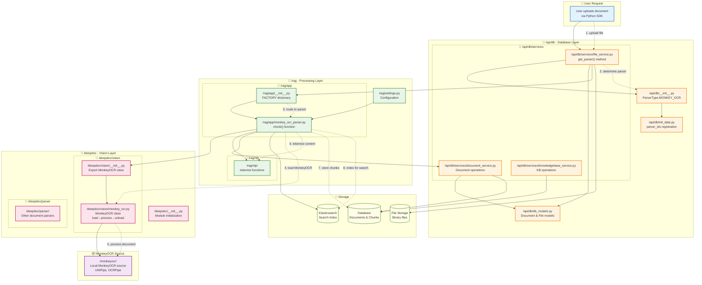
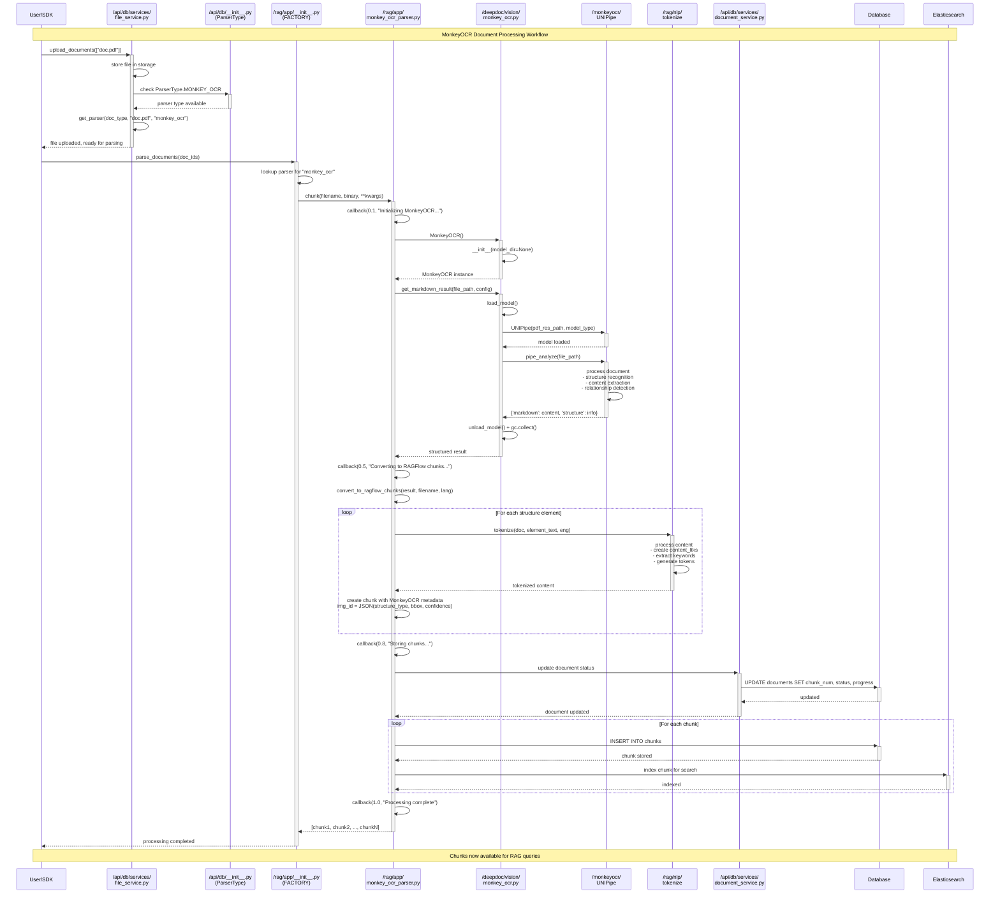

# MonkeyOCR Integration Workflow Diagrams

## 🏗️ **Component Architecture Overview**

This diagram shows how files in `/api/db`, `/deepdoc`, and `/rag` directories work together for MonkeyOCR integration:



---

## 🔄 **Detailed Processing Sequence**

This sequence diagram shows the step-by-step interaction between specific files during MonkeyOCR document processing:



---

## 📋 **File Interaction Summary**

### **1. 📁 `/api/db` Directory - Database Layer**

| File | Role | MonkeyOCR Integration |
|------|------|---------------------|
| `__init__.py` | Define parser types | ✏️ Add `MONKEY_OCR = "monkey_ocr"` |
| `init_data.py` | Register parsers | ✏️ Add `monkey_ocr:MonkeyOCR` to parser_ids |
| `db_models.py` | Database models | 📖 Reference Document/File models |
| `services/file_service.py` | File operations | ✏️ Add PDF/image detection in `get_parser()` |
| `services/document_service.py` | Document operations | 📖 Used to update document status |
| `services/knowledgebase_service.py` | KB operations | 📖 Used for knowledge base integration |

### **2. 📁 `/rag` Directory - Processing Layer**

| File | Role | MonkeyOCR Integration |
|------|------|---------------------|
| `app/__init__.py` | Parser factory | ✏️ Add MonkeyOCR to FACTORY dictionary |
| `app/monkey_ocr_parser.py` | Main parser logic | 🆕 Create new parser implementation |
| `nlp/` | Text processing | 📖 Used for tokenizing MonkeyOCR output |
| `settings.py` | Configuration | 📖 Reference for settings |

### **3. 📁 `/deepdoc` Directory - Vision Layer**

| File | Role | MonkeyOCR Integration |
|------|------|---------------------|
| `vision/__init__.py` | Vision module exports | ✏️ Export MonkeyOCR class |
| `vision/monkey_ocr.py` | MonkeyOCR wrapper | 🆕 Create new vision component |
| `parser/` | Document parsers | 📖 Reference other parser patterns |

### **4. 📦 **MonkeyOCR Source**

| Location | Role | Integration |
|----------|------|-------------|
| `/monkeyocr/` | Local source code | 🆕 Clone MonkeyOCR repository |
| `/monkeyocr/magic_pdf/pipe/` | Core processing | 📖 UNIPipe, OCRPipe classes |

---

## 🔄 **Data Flow Explanation**

### **Step 1: File Upload & Parser Selection**
```
User SDK → file_service.py → __init__.py (ParserType) → init_data.py (registration)
```

### **Step 2: Parser Routing**
```
FACTORY dictionary → monkey_ocr_parser.py → deepdoc/vision/monkey_ocr.py
```

### **Step 3: MonkeyOCR Processing**
```
MonkeyOCR class → load_model() → UNIPipe → pipe_analyze() → unload_model()
```

### **Step 4: Content Processing**
```
Structure extraction → tokenization → chunk creation → metadata embedding
```

### **Step 5: Storage**
```
Database (structured data) + Elasticsearch (search index) + File storage (binaries)
```

---

## 🎯 **Key Integration Points**

1. **Parser Registration**: `/api/db/__init__.py` + `/api/db/init_data.py`
2. **File Routing**: `/api/db/services/file_service.py`
3. **Processing Pipeline**: `/rag/app/__init__.py` → `/rag/app/monkey_ocr_parser.py`
4. **Vision Processing**: `/deepdoc/vision/monkey_ocr.py`
5. **Model Integration**: `/monkeyocr/` local source
6. **Data Storage**: Existing RAGFlow database schema

This workflow ensures MonkeyOCR integrates seamlessly with RAGFlow's existing architecture while maintaining the load→process→unload memory management strategy! 🚀 